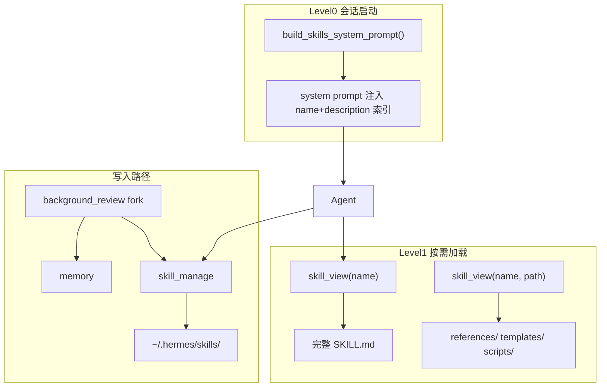
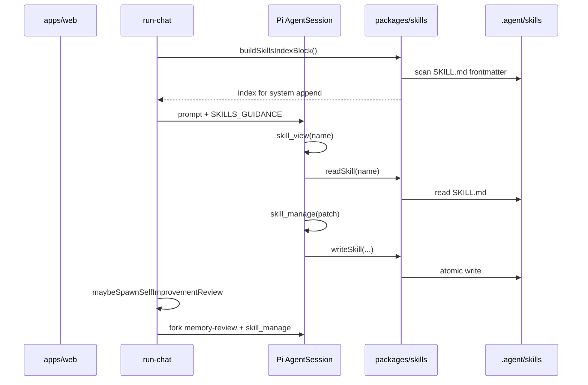

# letsTalk Skills 体系 MVP 方案

## 调研结论：Hermes Skills 怎么工作的

Hermes 的 Skills 不是 Cursor IDE 配置，而是 **Agent 运行时的「程序性记忆」**（怎么做某类任务），与 **declarative memory**（MEMORY.md / USER.md，记事实）分工明确。



### 核心源码（本地 Hermes：`/Users/zs/learn/AI/hermes-agent`）

| 模块 | 文件 | 职责 |
|------|------|------|
| 索引 + 读取 | [`tools/skills_tool.py`](file:///Users/zs/learn/AI/hermes-agent/tools/skills_tool.py) | `skills_list()`、`skill_view(name, path?)`；扫描 `SKILL.md` frontmatter；agentskills.io 兼容 |
| 写入 | [`tools/skill_manager_tool.py`](file:///Users/zs/learn/AI/hermes-agent/tools/skill_manager_tool.py) | `skill_manage`：create / edit / patch / delete / write_file / remove_file |
| System 索引 | [`agent/prompt_builder.py`](file:///Users/zs/learn/AI/hermes-agent/agent/prompt_builder.py) `build_skills_system_prompt()` | 按 category 输出紧凑索引（~3k tokens）；磁盘 snapshot 缓存 |
| 行为引导 | 同文件 `SKILLS_GUIDANCE` | 复杂任务完成后用 skill_manage 保存；加载后发现过时立即 patch |
| 自进化 | [`agent/background_review.py`](file:///Users/zs/learn/AI/hermes-agent/agent/background_review.py) | 每 N 轮 fork 子 Agent，**工具白名单仅 memory + skill_manage** |
| 安全（MVP 可简化） | [`tools/skills_guard.py`](file:///Users/zs/learn/AI/hermes-agent/tools/skills_guard.py) | Hub 安装扫描；Agent 创建默认关闭 |

**渐进披露三档：**

1. **Level 0**：system 里 `<available_skills>` 索引（name + description + category）
2. **Level 1**：`skill_view(name)` → 完整 SKILL.md + linked files 列表
3. **Level 2**：`skill_view(name, "references/xxx.md")` → 附属文件

**skill_manage 设计要点：**

- 存储根目录单一真源（Hermes：`~/.hermes/skills/`）
- `patch` 优先于 `edit`（省 token）
- 创建时校验 name（≤64）、description（≤1024）、内容大小上限
- 写成功后 `clear_skills_system_prompt_cache()` 刷新索引

---

## letsTalk 现状与差距

| 能力 | 现状 | 差距 |
|------|------|------|
| 记忆 + 后台 review | 已有 [`background-memory-review.ts`](packages/agent-runtime/src/background-memory-review.ts)，fork `sessionKind: "memory-review"`，仅 `memory` 工具 | 需扩展为 **memory + skill_manage** |
| 写盘白名单 | [`.agent/` 可写`](packages/agent-runtime/src/agent-write-policy.ts)（除 conversations/debug/menu-map） | `.agent/skills/` 自然可用；但应 **禁止裸 write/edit 改 skill**，统一走 skill_manage |
| System append | [`lets-talk-system-append.ts`](packages/context/src/lets-talk-system-append.ts) 注入 memory/PM 规则 | 需加 **Skills 索引 + SKILLS_GUIDANCE** |
| memory-guidance 已预留 | [`memory-guidance.ts`](packages/context/src/prompt/memory-guidance.ts) L19：「多步流程用 skill/文档，勿堆进 CORE」 | 与 Skills 体系直接衔接 |
| PROMPT_OPTIMIZATION | [§11](docs/PROMPT_OPTIMIZATION_V2.md) 标注 Page Skill 未实现 | 本方案用 **通用 Hermes 式 Skills** 替代旧 Page Skill 设计 |

你已确认范围：**MVP（索引 + view + manage + 后台 review）**，**仅网页 Agent**，**存 `.agent/skills/`**。不含 Hub / Curator / Web UI。

---

## 目标架构（letsTalk MVP）



### 存储布局

```text
.agent/skills/                          # Agent 可读写（via skill_manage）
├── erp/
│   ├── read-java-controller/
│   │   ├── SKILL.md
│   │   └── references/
│   └── trace-menu-to-code/
│       └── SKILL.md
├── pm/
│   └── requirement-cell/
│       └── SKILL.md
└── .skills-index.json                  # mtime 快照缓存（对齐 Hermes snapshot）
```

**Bundled 种子 Skills**（只读，随仓库分发）：

- 放 [`packages/skills-bundled/`](packages/skills-bundled/) 或 [`.agent/templates/skills/`](.agent/templates/skills/)
- 首次启动或 `skills_list` 为空时 copy 到 `.agent/skills/`
- frontmatter 标记 `metadata.letsTalk.source: bundled`，**skill_manage 禁止 delete/edit**（可 fork 为用户 skill）

建议种子（对齐你之前讨论的高 ROI 场景）：

1. `read-java-controller` — list_methods → read_method
2. `trace-menu-to-code` — 菜单名 → menu-map/grep → 前后端路径
3. `requirement-cell` — PM 五格需求（explore/prd 均可用）

### 新包 `@lets-talk/skills`

职责与 [`@lets-talk/memory`](packages/memory/) 对称：

| 函数 | 说明 |
|------|------|
| `scanSkillIndex(workspaceRoot)` | 递归找 `SKILL.md`，解析 YAML frontmatter |
| `buildSkillsSystemBlock(skills, activeTools?)` | 生成 Hermes 风格 `<available_skills>` 块 |
| `readSkillContent(workspaceRoot, name, filePath?)` | Level 1/2 读取 |
| `manageSkill(workspaceRoot, action, params)` | create/patch/... 核心逻辑 + 校验 |
| `isSkillProtected(meta)` | bundled 只读判断 |
| `invalidateSkillsIndexCache(workspaceRoot)` | skill_manage 写后刷新 |

格式遵循 [agentskills.io](https://agentskills.io/specification)：`name`、`description` 必填；可选 `references/`、`scripts/`、`templates/`、`assets/`。

### Agent 工具（注册于 [`create-session.ts`](packages/agent-runtime/src/create-session.ts)）

| 工具 | 行为 |
|------|------|
| `skill_view` | `name` + 可选 `file_path`；返回 content + linked_files |
| `skill_manage` | create / edit / patch / delete / write_file / remove_file（Hermes 同构） |
| `skills_list` | **可选**：返回 JSON 索引；与 system 索引冗余但便于 Agent 刷新；建议保留（Hermes 有） |

**开关：** `LETS_TALK_SKILLS=1`（默认开启）；`0` 时不注册工具、不注入索引。

**与 write/edit 关系：** skill 文件 **仅** 经 `skill_manage` 写入；在 tool description 和 [`agent-scoped-write-tools.ts`](packages/agent-runtime/src/agent-scoped-write-tools.ts) 中明确禁止对 `.agent/skills/` 使用裸 write/edit。

### System Prompt 注入

在 [`lets-talk-system-append.ts`](packages/context/src/lets-talk-system-append.ts) 追加：

1. **`SKILLS_GUIDANCE`**（新文件 [`packages/context/src/prompt/skills-guidance.ts`](packages/context/src/prompt/skills-guidance.ts)）— 移植 Hermes 核心句：
   - 任务匹配时 **必须** skill_view
   - 复杂任务完成后 skill_manage 保存
   - 加载后发现错误立即 patch
2. **`<available_skills>` 索引块** — 来自 `buildSkillsSystemBlock()`；软顶 ~80 条 / ~3KB（超出截断 + 提示用 skills_list）

explore / prd 两种 chatMode **均启用** Skills（PM 也需要 requirement-cell 等）。

### 后台 Self-Improvement Review

扩展 [`background-memory-review.ts`](packages/agent-runtime/src/background-memory-review.ts) → 重命名为 `background-self-improvement-review.ts`（或保持文件名、扩展行为）：

| 项 | 设计 |
|----|------|
| 触发 | `LETS_TALK_SELF_IMPROVE_NUDGE_INTERVAL`（默认 10）；0 关闭 |
| 跳过条件 | 当轮已调 `memory` 或 `skill_manage` 则跳过（对齐 Hermes） |
| Fork 工具 | `memory` + `skill_manage`（新增 `sessionKind: "self-improvement-review"`） |
| Prompt | 合并 MEMORY_REVIEW + SKILLS_REVIEW（新），强调 **class-level skill**、优先 patch 已有 skill |
| 独立计数 | 可选：`LETS_TALK_SKILL_NUDGE_INTERVAL` 与 memory 分开；MVP 建议 **合并为一个 interval**，降低复杂度 |

Review prompt 参考 Hermes [`background_review.py`](file:///Users/zs/learn/AI/hermes-agent/agent/background_review.py) L46-170 的 skill 段落，但去掉 Hub/bundled/pinned curator 逻辑，仅保留 bundled 只读保护。

### 安全（MVP 最小集）

- frontmatter + body 简单 injection 关键词检测（复用 Hermes `_INJECTION_PATTERNS` 子集）
- bundled skill 不可 delete/edit
- 单 skill 内容上限 ~100KB；单附属文件 ~1MB（对齐 Hermes）
- **不做** Hub 安装扫描、Curator、pin

---

## 实施步骤

### Phase 1 — 基础设施（`@lets-talk/skills`）

- 新建 `packages/skills/`：frontmatter 解析、目录扫描、索引缓存、读写 API
- 单元测试：解析、name 校验、patch、bundled 保护、索引 mtime 失效

### Phase 2 — Agent 工具 + System 注入

- `packages/agent-runtime/src/skill-tools.ts`：Pi `ToolDefinition` 三件套
- 修改 [`create-session.ts`](packages/agent-runtime/src/create-session.ts)：条件注册；self-improvement-review sessionKind
- 修改 [`lets-talk-system-append.ts`](packages/context/src/lets-talk-system-append.ts) + `skills-guidance.ts`
- 更新 [`AGENTS.md`](AGENTS.md)：Skills 指针（短），Java 规则不重复

### Phase 3 — 自进化闭环

- 扩展 background review：双工具 fork + 合并 prompt
- `run-chat.ts` 中 tool_execution 回调：`skill_manage` 成功 → `markSelfImprovementWrittenThisTurn` + `invalidateSkillsIndexCache`
- 下轮 system append 重建索引（或 session 内 cache + mtime 校验）

### Phase 4 — 种子 Skills + 文档

- 添加 3 个 bundled skills + 安装逻辑
- 更新 [`.env.example`](.env.example)：`LETS_TALK_SKILLS`、`LETS_TALK_SELF_IMPROVE_NUDGE_INTERVAL`
- 短文档 [`docs/SKILLS_V1.md`](docs/SKILLS_V1.md)：用法、目录结构、与 memory 分工

---

## 与 Memory 的分工（写进 SKILLS_GUIDANCE）

| 存什么 | 用什么 |
|--------|--------|
| 用户称呼、偏好、仓库惯例、踩坑一句话 | `memory` → CORE/USER |
| **怎么做** 某类任务的可复用流程（读 Controller、写需求格、调试 SSE） | `skill_manage` → `.agent/skills/` |
| 当前这单需求 | `requirementDraft`（不变） |

---

## 明确不做（MVP 范围外）

- Skills Hub / GitHub 安装 / CLI `hermes skills install`
- Curator 归档、pin、usage 统计
- Web UI 浏览/管理 Skills
- Cursor IDE `.cursor/skills/` 互通
- Page Skill 懒编译（旧 [AGENT_OS_TS_PI_DESIGN](docs/AGENT_OS_TS_PI_DESIGN.md) 方案，已废弃）

---

## 验收标准

1. 新会话 system prompt 含 `<available_skills>` 索引（含 3 个 bundled skills）
2. 用户问「按 read-java-controller 查某 Controller」→ Agent 调 `skill_view` 并按流程 list_methods → read_method
3. 用户说「把这个排查流程保存成 skill」→ Agent 调 `skill_manage(create)`，磁盘出现 `.agent/skills/.../SKILL.md`
4. 10 轮对话后后台 review fork 运行，可 patch 已有 skill 或 memory，不阻塞主回复
5. bundled skill 不可被 delete；patch 用户自建 skill 成功且索引刷新
