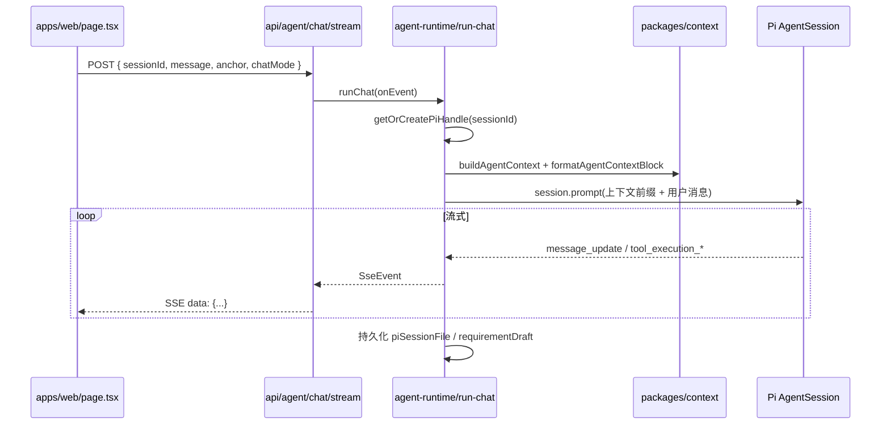

# letsTalk 代码结构导读

> 面向「想快速读懂仓库」的开发者。以当前代码为准；设计细节见 [AGENT_OS_DESIGN.md](./AGENT_OS_DESIGN.md)，阶段进度见 [IMPLEMENTATION_PHASES.md](./IMPLEMENTATION_PHASES.md)。

---

## 1. 项目是什么

**letsTalk** 是一个面向产品经理与研发的 **代码库对话 Agent**：

- 绑定一个「运行根目录」（letsTalk 仓库本身），其中 `workFront/`、`workBack/` 放待分析的前后端代码（可以是真实项目或符号链接）。
- 用户在网页里提问，Agent 通过 [Pi SDK](https://github.com/earendil-works/pi) 自主 `grep` / `read` / `find` 查代码，流式返回答案。
- 支持 **锚点**（选定某个 Vue 页面或系统菜单），让对话聚焦在该页面相关代码。
- 支持 **写需求模式**（`chatMode: prd`）：Agent 边聊边维护右侧「需求清单」，可导出 PRD Markdown。

技术栈：**pnpm monorepo** + **Next.js 15**（Web）+ **Pi Coding Agent**（Node 运行时）+ **SSE** 流式推送。

---

## 2. 一张图看懂请求链路



**记住这条主线即可**：`page.tsx` → `route.ts` → `run-chat.ts` → `create-session.ts`（Pi）→ 工具读 `workFront` / `workBack`。

---

sequenceDiagram
  participant U as 用户
  participant P as page.tsx send()
  participant R as route.ts POST
  participant RC as runChat()
  participant G as getOrCreatePiHandle
  participant CS as createPiSession
  participant Pi as AgentSession (Pi SDK)
  participant LLM as DeepSeek API
  participant T as grep/read/工具

  U->>P: 点击发送
  P->>R: fetch POST /api/agent/chat/stream
  R->>RC: runChat({ onEvent: enqueue })
  RC->>G: 取/建 Pi 句柄
  G->>CS: createPiSession
  CS->>Pi: createAgentSession
  RC->>RC: buildAgentContext + subscribe
  RC->>Pi: session.prompt(userText)
  Pi->>LLM: 多轮推理
  Pi->>T: tool_execution
  T-->>Pi: 工具结果
  Pi-->>RC: subscribe 事件
  RC-->>R: onEvent(SseEvent)
  R-->>P: SSE data: {...}
  P->>P: 更新 Transcript UI
  RC->>RC: turn_end, bindPiSessionFile
  P->>P: PUT /api/conversations/:id 持久化 UI 历史


## 3. 目录结构（只看这些）

```text
letsTalk/                          ← WORKSPACE_ROOT（Pi 的 cwd，工具路径基准）
├── apps/web/                      ← Next.js 前端 + BFF API
│   ├── app/page.tsx               ← 主界面（会话、锚点、对话、需求画布）
│   ├── app/api/                   ← HTTP 接口（均 runtime=nodejs）
│   ├── components/                ← MenuAnchorPicker、RequirementCanvas
│   └── lib/                       ← 前端专用：分组、导出 PRD、菜单树等
├── packages/
│   ├── agent-runtime/             ← ★ 核心：Pi 会话、跑对话、自定义工具
│   ├── context/                   ← 每轮 JIT 上下文（锚点预览、AGENTS.md、PM 规则）
│   ├── conversation/              ← 会话 JSON 持久化
│   ├── ast-tools/                 ← Java list_methods / read_method 解析
│   ├── memory/                    ← .agent/memory 读写（Agent 自动记忆默认关闭）
│   └── shared-types/              ← 前后端共用 TypeScript 类型
├── workFront/                     ← 待分析前端（Vue）
├── workBack/                      ← 待分析后端（Java，当前为符号链接）
├── .agent/                        ← 运行时数据（对话、Pi jsonl、菜单映射、调试日志）
│   ├── conversations/*.json       ← 会话元数据 + Transcript
│   ├── conversations/pi/*.jsonl   ← Pi 原生多轮上下文
│   ├── menu-map/                  ← 系统菜单树 JSON
│   ├── hints/                     ← PM 业务线索（仅供参考）
│   ├── memory/                    ← 手工笔记（仅供参考）
│   └── templates/                 ← PRD / 研发附录模板
├── AGENTS.md                      ← 注入模型的架构规则（会被 context 包读取）
├── docs/                          ← 设计文档
└── legacy/                        ← 旧 Python ai-core 等，非当前主路径
```

---

## 4. Monorepo 包职责

| 包名 | 路径 | 职责 |
|------|------|------|
| `@lets-talk/web` | `apps/web` | React 页面 + Next API Routes |
| `@lets-talk/agent-runtime` | `packages/agent-runtime` | 封装 Pi：`createPiSession`、`runChat`、Java/需求/记忆工具 |
| `@lets-talk/context` | `packages/context` | `buildAgentContext`：锚点预览、目录提示、`AGENTS.md`、PM 模式资源 |
| `@lets-talk/conversation` | `packages/conversation` | `.agent/conversations/{id}.json` CRUD |
| `@lets-talk/ast-tools` | `packages/ast-tools` | 纯函数：解析 Java 方法列表与单方法源码 |
| `@lets-talk/memory` | `packages/memory` | `.agent/memory/*.md` 读写与过期检测 |
| `@lets-talk/shared-types` | `packages/shared-types` | `SseEvent`、`AgentAnchor`、`RequirementDraftState` 等 |

依赖方向（简）：`web` → `agent-runtime` → `context` / `conversation` / `ast-tools` / `memory` → `shared-types`。

---

## 5. 关键代码逐文件

### 5.1 创建 Pi 会话 — `packages/agent-runtime/src/create-session.ts`

这是 **Agent 能力的开关**：

```typescript
// 只读工具（Pi 内置）
const READONLY_TOOLS = ["read", "grep", "find", "ls", "list_methods", "read_method"];

// 自定义工具
createJavaAstTools(workspace)      // Java 方法级导航
createMemoryTools(workspace)       // 默认关闭（ENABLE_MEMORY_TOOLS = false）
createRequirementDraftTools(...)   // chatMode=prd 且传入 sessionId 时启用
```

要点：

- `cwd` = `WORKSPACE_ROOT`，所有 `read/grep` 路径相对此根。
- `LLM_API_KEY` 写入 Pi 的 `AuthStorage`（当前 provider 为 deepseek）。
- `SessionManager.open(piSessionFile)` 用于 **恢复** 同一 session 的多轮 Pi 上下文（HMR 或重启后）。
- `thinkingLevel: "off"` — 不展示 extended thinking。

### 5.2 跑一轮对话 — `packages/agent-runtime/src/run-chat.ts`

`runChat` 是 **业务编排中心**：

1. **会话缓存**：内存 `Map<sessionId, PiSessionHandle>`，同 id 复用 Pi session。
2. **上下文组装**：调用 `buildAgentContext`，再 `formatAgentContextBlock` 拼成 XML 风格前缀，prepend 到用户消息。
3. **事件桥接**：订阅 Pi 的 `session.subscribe`，转成 `SseEvent`（`assistant_delta`、`tool_start`、`tool_output` 等）。
4. **PRD 模式**：维护 `requirementDraft`，工具 `update_requirement_draft` 更新后通过 SSE 推 `requirement_state` / `agent_actions`。
5. **调试**：`LETS_TALK_DEBUG=1` 时每轮请求/响应写入 `.agent/debug/{sessionId}/`。

### 5.3 HTTP 入口 — `apps/web/app/api/agent/chat/stream/route.ts`

- 必须 `runtime = "nodejs"`（Pi 依赖 `node:fs`，不能跑 Edge）。
- 动态 `import("@lets-talk/agent-runtime")`，避免 Webpack 把 Pi 打进浏览器包。
- 响应 `Content-Type: text/event-stream`，每行 `data: {JSON}\n\n`。

请求体类型见 `packages/shared-types/src/index.ts` → `ChatStreamRequest`。

### 5.4 主界面 — `apps/web/app/page.tsx`

单页应用式布局（约 1200+ 行，可按功能块读）：

| 区域 | 状态 / 行为 |
|------|-------------|
| 最左 | 会话列表，按日期分组 |
| 左中 | 锚点选择：`MenuAnchorPicker`（系统菜单）或手动文件路径 |
| 右上 | Transcript：用户消息、助手流式文本、工具块折叠 |
| 右下 | 输入框；模式切换 explore / prd |
| PRD | `RequirementCanvas` 展示需求清单与 Agent 建议动作 |

本地持久：`sessionStorage` 存 `sessionId`、`anchor`、`chatMode`。

### 5.5 JIT 上下文 — `packages/context/src/build-context.ts`

每轮对话 **不替 Agent 做 grep**，只注入「导航信息」：

| 字段 | 来源 |
|------|------|
| `arch_rules` | `AGENTS.md` + 前后端目录说明 |
| `anchor_preview_content` | 文件锚点：读文件前 N 行；菜单锚点：面包屑、路由、grep 提示 |
| `pm_rules` | `chatMode === "prd"` 时注入 PM 写作规则 |
| `requirement_draft_snapshot` | 当前需求草稿 JSON 摘要 |
| `hints_directory_hint` | `.agent/hints/` 文件列表 |

格式化输出：`formatAgentContextBlock` → 包在 `<agent_context>...</agent_context>` 里给模型读。

### 5.6 Java 手术刀 — `packages/ast-tools` + `java-ast-tools.ts`

- `listMethods`：正则扫描方法签名 + Spring 注解（无 tree-sitter 重依赖）。
- `readMethod`：按方法名截取方法体完整代码。
- 规则写在 `AGENTS.md` 和工具的 `promptGuidelines`：**所有 `*Controller.java` 必须先 list_methods**。

### 5.7 会话持久化 — `packages/conversation/src/store.ts`

- 路径：`.agent/conversations/{sessionId}.json`
- 内容：`items`（Transcript）、`anchor`、`chatMode`、`requirementDraft`、`piSessionFile`（相对路径）
- Pi 原生历史在 `.agent/conversations/pi/{sessionId}.jsonl`

### 5.8 类型契约 — `packages/shared-types`

读代码时优先打开：

- `src/index.ts` — `SseEvent`、`ChatStreamRequest`、`ChatMode`
- `src/anchor.ts` — 锚点五种 kind：`vue` | `java` | `route` | `file` | `menu`
- `src/requirement-draft.ts` — 需求清单字段与 AgentAction

---

## 6. Web API 一览

| 方法 | 路径 | 作用 |
|------|------|------|
| POST | `/api/agent/chat/stream` | 主对话 SSE |
| GET/POST | `/api/conversations` | 列表 / 新建会话 |
| GET/PATCH/DELETE | `/api/conversations/[id]` | 读、更新、删会话 |
| GET | `/api/conversations/[id]/context` | 上下文 token 占用 |
| GET | `/api/workspace` | 展示 WORKSPACE_ROOT、前后端路径 |
| GET | `/api/workspace/anchors` | 可选取的文件锚点列表 |
| GET | `/api/menu/tree` | 系统菜单树（依赖 menu-map 或 DB） |
| POST | `/api/export/dev-appendix` | 导出研发附录 Markdown |
| GET | `/api/health` | 健康检查 |

---

## 7. 两种对话模式

| | **explore**（默认） | **prd**（写需求） |
|---|---------------------|-------------------|
| 目标 | 研发查代码、解释逻辑 | PM 整理可验收的需求文档 |
| 额外注入 | 无 | `pm_rules`、hints 目录、需求草稿快照 |
| 额外工具 | 无 | `update_requirement_draft` |
| UI | 仅 Transcript | 右侧 `RequirementCanvas` |
| 规则来源 | `AGENTS.md` | 另有 `.agent/templates/prd-template.md` 摘要 |

---

## 8. 锚点（Anchor）怎么理解

`AgentAnchor` 告诉 Agent「用户当前关心哪里」：

- **file / vue**：`ref` 为相对 `WORKSPACE_ROOT` 的路径，如 `workFront/src/views/Login.vue`；JIT 会读文件预览。
- **menu / route**：来自 ERP 系统菜单（`sys_menu`）；`ref` 多为前端路由片段，Agent 应用 `grep` 搜路由而非假定单文件。
- **java**：后端类文件路径。

未选锚点 → `mode: explore`（全库探索）；有锚点 → `mode: focused`。

---

## 9. Agent 可用工具

| 工具 | 来源 | 用途 |
|------|------|------|
| read, grep, find, ls | Pi 内置 | 读文件、搜索、列目录 |
| list_methods, read_method | 自定义 | Java 大文件方法级阅读 |
| update_requirement_draft | 自定义 | PRD 模式更新需求清单 |
| save_memory, read_memory | 自定义（**默认关闭**） | 跨会话笔记 |

---

## 10. `.agent/` 运行时目录

| 子目录 | 说明 |
|--------|------|
| `conversations/` | 会话 JSON + Pi jsonl |
| `menu-map/` | `pnpm sync-menu` 生成的菜单 JSON |
| `hints/` | 业务背景 md，**仅供参考**，Agent 仍须 grep/read 核实 |
| `memory/` | 手工记忆，**仅供参考** |
| `templates/` | PRD、研发附录模板 |
| `debug/` | `LETS_TALK_DEBUG=1` 时的 turn 日志 |

---

## 11. 环境变量（`.env`）

| 变量 | 必填 | 含义 |
|------|------|------|
| `LLM_API_KEY` | 是 | DeepSeek API Key |
| `WORKSPACE_ROOT` | 是 | letsTalk 仓库绝对路径 |
| `FRONTEND_ROOT` | 否 | 默认 `workFront` |
| `BACKEND_ROOT` | 否 | 默认 `workBack` |
| `PORT` | 否 | 默认 3000 |
| `MENU_DB_*` | 否 | 从 MySQL 同步菜单时用 |
| `LETS_TALK_DEBUG` | 否 | `1` 开启调试落盘 |

---

## 12. 本地开发与调试

```bash
pnpm install
cp .env.example .env   # 填 LLM_API_KEY、WORKSPACE_ROOT

pnpm minimal           # 终端直接测 Pi（不启网页）
pnpm dev               # http://127.0.0.1:3000
pnpm smoke             # 冒烟脚本
pnpm sync-menu         # 同步菜单到 .agent/menu-map/
```

**建议阅读顺序**（由外到内）：

1. `README.md` → 本文件
2. `apps/web/app/page.tsx`（看 UI 如何调 API、消费 SSE）
3. `apps/web/app/api/agent/chat/stream/route.ts`
4. `packages/agent-runtime/src/run-chat.ts`
5. `packages/agent-runtime/src/create-session.ts`
6. `packages/context/src/build-context.ts`
7. 按需：`java-ast-tools.ts`、`requirement-draft-*.ts`、`conversation/store.ts`

---

## 13. 与旧代码的关系

- `legacy/ai-core/`：早期 Python + LangGraph 方案，**当前主路径已迁至 TypeScript + Pi**。
- `legacy/test-project/`：示例后端，`workBack` 符号链接指向此处。
- 新功能应改 `apps/`、`packages/`，不要回到 legacy 除非刻意维护旧系统。

---

## 相关文档

| 文档 | 何时看 |
|------|--------|
| [AGENT_OS_DESIGN.md](./AGENT_OS_DESIGN.md) | 架构决策、契约、原则 |
| [CONTEXT_MANAGEMENT_V1.md](./CONTEXT_MANAGEMENT_V1.md) | **上下文 V1 推荐方案**（Pointer + Pull + 乐观锁，评审稿） |
| [IMPLEMENTATION_PHASES.md](./IMPLEMENTATION_PHASES.md) | 阶段验收与 backlog |
| [DEBUG_GUIDE.md](./DEBUG_GUIDE.md) | Cursor 断点跟读：普通对话、需求清单 |
| [TYPESCRIPT_BY_FEATURE.md](./TYPESCRIPT_BY_FEATURE.md) | **按功能学语法**：探索 / 锚点 / PRD / 会话… |
| [TYPESCRIPT_FOR_BEGINNERS.md](./TYPESCRIPT_FOR_BEGINNERS.md) | 本项目常用 TypeScript 语法（初学者） |
| [TYPESCRIPT_DEEP_DIVE.md](./TYPESCRIPT_DEEP_DIVE.md) | 事件体系、联合类型进阶、类型谓词 |
| [DEBUG_LOGGING.md](./DEBUG_LOGGING.md) | `LETS_TALK_DEBUG` 落盘日志 |
| [PI_SDK_NODE_INTEGRATION.md](./PI_SDK_NODE_INTEGRATION.md) | Pi API 细节 |
| [PM_REQUIREMENT_ASSISTANT.md](./PM_REQUIREMENT_ASSISTANT.md) | 写需求模式产品方案 |
| [AGENTS.md](../AGENTS.md) | 注入模型的运行时规则（与代码同步维护） |

---

*文档版本：与仓库 2026-05 代码对齐。若实现变更，以 `grep` / `read` 源码为准。*
