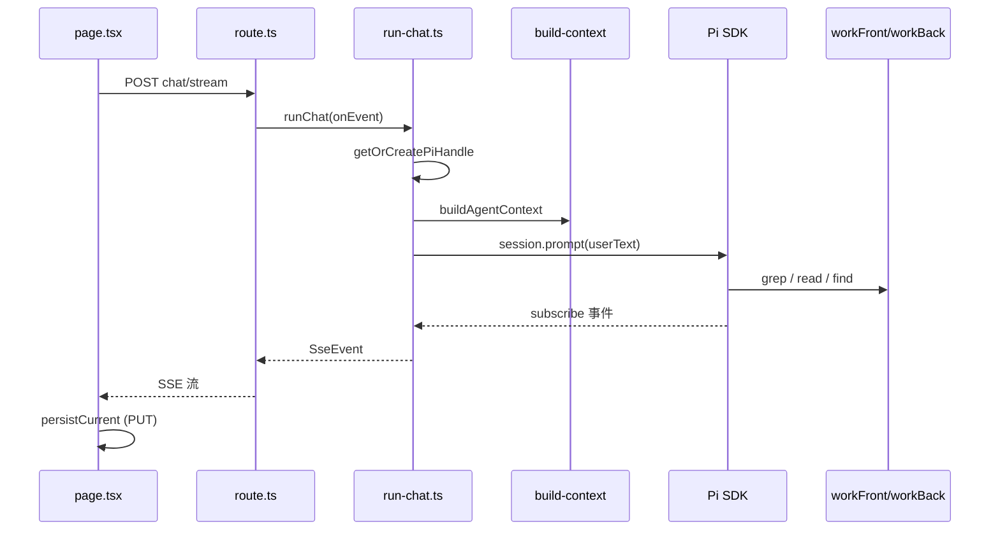

# letsTalk 调试指南

> 用 Cursor / VS Code 断点跟读项目。配合 [CODEBASE_GUIDE.md](./CODEBASE_GUIDE.md) 阅读效果更佳。

---

## 1. 调试前准备

### 1.1 环境

```bash
cp .env.example .env
# 必填：LLM_API_KEY、WORKSPACE_ROOT（letsTalk 仓库绝对路径）
```

可选（落盘每轮完整上下文，不断点也能跟流程）：

```bash
LETS_TALK_DEBUG=1
```

详见 [DEBUG_LOGGING.md](./DEBUG_LOGGING.md)。

### 1.2 启动方式（重要）

| 方式 | 服务端断点 | 说明 |
|------|-----------|------|
| 终端 `pnpm dev` | ❌ 一般无效 | 调试器未挂到 Next 进程 |
| **F5 → `letsTalk: Next 服务端 (推荐)`** | ✅ | 配置在 `.vscode/launch.json` |
| F5 → `letsTalk: Next 全栈调试` | ✅ 前后端 | 额外自动打开 Chrome |
| F5 → `letsTalk: 仅终端测 Pi (minimal)` | ✅ 仅 agent-runtime | 不经过网页，适合 isolate 问题 |

**不要用根目录 `pnpm dev` + 旧版 `node-terminal` 配置**，否则断点空心、CALL STACK 只有 `pnpm`。

### 1.3 断点打在哪个目录？

| 编辑 | 实际执行 | 做法 |
|------|----------|------|
| `packages/agent-runtime/src/*.ts` | `packages/agent-runtime/dist/*.js` | 改 src 后 F5 会自动 pre-build；手动：`pnpm --filter @lets-talk/agent-runtime build` |
| `apps/web/app/**/*.ts` | Next 编译后的 route | 直接断 `src` 即可 |

`agent-runtime` 已开启 `sourceMap`，断点应打在 **`src/`**，不要打在 `dist/`。

### 1.4 空心断点 ≠ 一定坏了

| 现象 | 原因 |
|------|------|
| `run-chat.ts` 灰色空心 | 模块尚未加载；**发第一条消息后**应变红 |
| 一直空心 | 调试进程不对 → 用 F5 推荐配置重启 |
| 改代码不生效 | 没 rebuild agent-runtime |

### 1.5 获取 sessionId

浏览器 DevTools → Application → Session Storage → `letsTalk.sessionId`  
或看 `.agent/conversations/*.json` 文件名。

---

## 2. 调试工具箱

### 2.1 Watch 推荐变量

在 `run-chat.ts` 的 `userText` 断点处添加：

| 变量 | 含义 |
|------|------|
| `options.message` | 用户原始输入 |
| `prefix` / `userText` | 模型实际收到的全文（含 JIT） |
| `ctx.mode` | `explore` / `focused` |
| `ctx.chat_mode` | `explore` / `prd` |
| `handle.modelLabel` | 如 `deepseek/deepseek-chat` |

在 `subscribe` 回调里：

| 变量 | 含义 |
|------|------|
| `sse?.type` | `assistant_delta` / `tool_start` / `tool_output` |
| `e.toolName` | 当前工具名 |

### 2.2 条件断点（减少噪音）

在 `run-chat.ts` 的 `piEventToSse` / `options.onEvent(sse)` 行：

```js
sse?.type === 'tool_start'
```

或：

```js
sse?.tool === 'grep'
```

### 2.3 DEBUG 落盘对照

开启 `LETS_TALK_DEBUG=1` 后，断点处看到的内容应与文件一致：

```text
.agent/debug/{sessionId}/
  turn-001-..._request.md    ← 等同 userText + 用户话
  turn-001-..._response.md   ← 助手全文 + 工具输出
  draft-..._request.md       ← update_requirement_draft 入参/前后对比
```

---

## 3. 场景一：普通对话（explore 模式）

**目标**：理解「用户发一句话 → Agent grep/read 查代码 → 流式回答」。

### 3.1 操作步骤

1. F5 → **`letsTalk: Next 服务端 (推荐)`**
2. 浏览器打开 `http://127.0.0.1:3000`
3. 顶部选 **「探索」**（不要选「需求整理」）
4. 可选：左侧选锚点；建议第一次选 **「全库探索」**
5. 输入测试问题并发送，例如：
   - `这个项目是做什么的？`（可能 read README）
   - `workFront 里 Login 页面在哪？`（可能 grep/find）

### 3.2 断点清单（按命中顺序）

| # | 文件 | 行号（约） | 看什么 |
|---|------|-----------|--------|
| 1 | `apps/web/app/page.tsx` | **409** `fetch("/api/agent/chat/stream"` | `body`：sessionId、message、anchor、chatMode=`explore` |
| 2 | `apps/web/app/api/agent/chat/stream/route.ts` | **55** `runChat({` | API 入口；`onEvent` → SSE |
| 3 | `packages/agent-runtime/src/run-chat.ts` | **219** `runChat` 入口 | 确认进入 agent-runtime |
| 4 | `run-chat.ts` | **111-113** `sessions.get` | 第二轮消息应直接 return（会话缓存） |
| 5 | `run-chat.ts` | **132** `createPiSession` | 仅首次或缓存失效；F11 进 `create-session.ts` |
| 6 | `create-session.ts` | **130** `createAgentSession` | `piOptions.tools` 白名单 |
| 7 | `packages/context/src/build-context.ts` | **35** | `mode`、`arch_rules`、锚点预览 |
| 8 | `run-chat.ts` | **334-336** `userText` | **最重要**：复制到 Watch 看完整 prompt |
| 9 | `run-chat.ts` | **354** `session.prompt` | F10 跨过；内部进 Pi SDK |
| 10 | `run-chat.ts` | **307-308** `piEventToSse` | 条件断点 `tool_start`；看 grep/read |
| 11 | `run-chat.ts` | **359** `turn_end` | 本轮结束 |
| 12 | `page.tsx` | **444** `JSON.parse` 后 | `event.type` 回到前端 |
| 13 | `page.tsx` | **508** `persistCurrent` | UI Transcript 写入 JSON |

### 3.3 流程图



### 3.4 关键理解点

1. **`options.message` ≠ 模型看到的**：模型收到的是 `userText` = `<agent_context>...</agent_context>` + 用户话。
2. **工具事件走 `piEventToSse`**：grep/read 的输入输出在 `tool_output.preview`。
3. **Pi 多轮记忆**在 `.agent/conversations/pi/{id}.jsonl`；UI 历史在 `.agent/conversations/{id}.json`，由前端 `PUT` 保存。
4. **第二轮对话**通常跳过 `createPiSession`，但 `buildAgentContext` 每轮都会执行。

### 3.5 进阶：跟 Java 查代码

发送：`DetailController 有哪些接口？`

额外断点：

| 文件 | 位置 |
|------|------|
| `packages/agent-runtime/src/java-ast-tools.ts` | `list_methods` / `read_method` 的 `execute` |
| `packages/ast-tools/src/java/parse.ts` | `listMethods` |

---

## 4. 场景二：需求整理 / 生成任务清单（prd 模式）

**目标**：理解「PM 口语描述 → Agent 调 `update_requirement_draft` → 右侧清单 + SSE → 持久化」。

### 4.1 操作步骤

1. F5 启动调试（同上）
2. 顶部切换 **「需求整理」**（`chatMode: "prd"`）
3. 建议左侧选 **系统菜单锚点** 或文件锚点
4. 发送口语化需求，例如：
   - `明细页删除按钮改成切换性别，只改北京省分`
   - `帮我把刚才说的整理成需求清单`

### 4.2 与 explore 模式的差异

| 项目 | explore | prd |
|------|---------|-----|
| `chatMode` | `"explore"` | `"prd"` |
| JIT 额外注入 | 无 | `pm_rules`、`hints`、`requirement_draft_snapshot` |
| Pi 工具 | 只读 + Java AST | 额外 `update_requirement_draft` |
| SSE 额外事件 | 无 | `requirement_state`、`agent_actions` |
| UI | 仅 Transcript | 右侧 `RequirementCanvas` |

工具注册位置：`create-session.ts` 中 `draftTools`（需传入 `sessionId`）。

### 4.3 断点清单（prd 专用）

在 **场景一** 断点基础上，增加：

| # | 文件 | 行号（约） | 看什么 |
|---|------|-----------|--------|
| A | `page.tsx` | **671** `setChatModePersist("prd")` | 模式切换 |
| B | `page.tsx` | **416** | `body.chatMode === "prd"` |
| C | `build-context.ts` | **89** `if (chat_mode === "prd")` | `pm_rules`、`requirement_draft_snapshot` |
| D | `run-chat.ts` | **227** `onDraftUpdated` | 草稿更新旁路（**不走** piEventToSse） |
| E | `run-chat.ts` | **246-247** | 回合开始推当前草稿 |
| F | `requirement-draft-tools.ts` | **73** `execute` | 工具入参 `items`、`replaceItems` |
| G | `requirement-draft-store.ts` | `applyDraftUpdate` | 合并/替换逻辑 |
| H | `requirement-draft-tools.ts` | **104** `notifyDraftUpdated` | 触发 listener |
| I | `run-chat.ts` | **228** `emitDraftEvents` | 推 `requirement_state` + `agent_actions` |
| J | `page.tsx` | **484-488** | 前端更新 `requirementDraft`、`agentActions` |
| K | `run-chat.ts` | **61-75** `persistDraft` | 草稿写入 conversation JSON |

### 4.4 草稿数据流（与 Pi 事件分离）

```text
session.prompt
  → 模型决定调用 update_requirement_draft
  → requirement-draft-tools.execute
  → applyDraftUpdate (内存 Map)
  → notifyDraftUpdated
  → run-chat 的 onDraftUpdated
  → onEvent({ type: "requirement_state" })
  → persistDraft → .agent/conversations/{id}.json
```

**注意**：这条链路不经过 `piEventToSse`。若只断 `subscribe` 回调，会误以为清单没更新。

### 4.5 右侧画布

组件：`apps/web/components/RequirementCanvas.tsx`  
展示逻辑：`apps/web/lib/format-requirement-draft.ts`

调试 UI 渲染可在 `RequirementCanvas` 入口断点，Watch `draft.items`。

### 4.6 导出 PRD

头部「导出」按钮 → `apps/web/lib/export-prd.ts`  
含研发附录时 → `POST /api/export/dev-appendix` → `agent-runtime/generate-dev-appendix.ts`

---

## 5. 场景三：其他重要路径

### 5.1 创建 Agent（能力开关）

**何时命中**：每个 sessionId **第一次**发消息，或 HMR 后缓存清空。

| 文件 | 行号 | 看什么 |
|------|------|--------|
| `create-session.ts` | **78-84** | `SessionManager.open` vs `create` |
| `create-session.ts` | **106-110** | `toolNames` 白名单 |
| `create-session.ts` | **121-125** | `customTools` 注册 |
| `create-session.ts` | **130** | `createAgentSession` 返回 `session` |

**改 Agent 能力**（加工具、换模型逻辑）都在这里。

### 5.2 锚点与 JIT 上下文

| 文件 | 说明 |
|------|------|
| `packages/context/src/build-context.ts` | 锚点校验、预览、explore/focused |
| `packages/context/src/format-block.ts` | 格式化为 `<agent_context>` XML |
| `packages/context/src/anchor-preview.ts` | 文件锚点读前 N 行 |
| `apps/web/components/MenuAnchorPicker.tsx` | 系统菜单选择 UI |

测试：选菜单锚点后发 `这个页面是干什么的？`，在 `build-context.ts` 看 `anchor_preview_content` 是否为菜单 grep 提示而非文件内容。

### 5.3 会话生命周期

| 动作 | API / 代码 |
|------|------------|
| 新建会话 | `POST /api/conversations` → `conversation/store.ts` `createConversation` |
| 切换会话 | `page.tsx` `switchConversation` → `GET /api/conversations/[id]` |
| 保存 Transcript | `PUT /api/conversations/[id]` → `page.tsx` `persistCurrent` |
| Pi jsonl 绑定 | `run-chat.ts` `bindPiSessionFile` |

断点：`packages/conversation/src/store.ts` 的 `saveConversation`。

### 5.4 SSE 桥接（理解「事件从哪来」）

| 环节 | 文件 | 说明 |
|------|------|------|
| 产生 | `run-chat.ts` `options.onEvent` | 所有 SseEvent 源头 |
| 编码 | `shared-types` `formatSseData` | `data: {...}\n\n` |
| 写出 | `route.ts` `enqueue` | ReadableStream |
| 消费 | `page.tsx` `while(reader.read())` | 解析 SSE 行 |

在 `route.ts:46` `enqueue` 断点，可与 `run-chat.ts:308` 对照同一 `event` 对象。

### 5.5 不启网页，只调 Pi

F5 → **`letsTalk: 仅终端测 Pi (minimal)`**

| 文件 | 说明 |
|------|------|
| `packages/agent-runtime/scripts/minimal.ts` | 终端直接 `session.prompt` |
| `create-session.ts` | 同上，无 SSE、无 JIT |

适合验证 `LLM_API_KEY`、工具是否可用。

---

## 6. 推荐的三条学习路线

### 路线 A：30 分钟速通（普通对话）

1. F5 服务端调试
2. 只打 4 个断点：`route.ts:55` → `run-chat.ts:334` → `run-chat.ts:354`（F10 跨过）→ `run-chat.ts:307`（条件 `tool_start`）
3. 发：`这个项目是做什么的？`
4. 对照 `.agent/debug/.../turn-001_request.md`（若开了 DEBUG）

### 路线 B：45 分钟（需求清单）

1. 完成路线 A
2. 切「需求整理」，加断点：`build-context.ts:89`、`requirement-draft-tools.ts:73`、`run-chat.ts:227`
3. 发：`明细页把删除改成切换性别，只北京`
4. 看右侧画布 + `requirement_state` SSE

### 路线 C：深入 Agent 配置

1. F5 minimal 或 explore 第一次消息的 `create-session.ts:130`
2. 改 `READONLY_TOOLS` 或 `ENABLE_MEMORY_TOOLS`，rebuild，观察工具列表变化

---

## 7. 常见问题

| 问题 | 处理 |
|------|------|
| 断点空心 | F5 用「Next 服务端 (推荐)」，不要用终端裸 `pnpm dev` |
| `run-chat` 不断 | 先发一条消息；模块是动态 import 的 |
| 改了 `run-chat.ts` 没变化 | `pnpm --filter @lets-talk/agent-runtime build` 后重启 F5 |
| CALL STACK 只有 pnpm | 调试进程错误，换 launch 配置 |
| `session.prompt` 进去很深 | 正常，Pi 内部；用 DEBUG 日志或只在 subscribe 断点 |
| prd 模式清单不更新 | 断 `notifyDraftUpdated` / `onDraftUpdated`，不要只断 `piEventToSse` |
| 前端断点不住 | 用「全栈调试」或 Chrome DevTools 断 `page.tsx` |

---

## 8. 相关文档

| 文档 | 内容 |
|------|------|
| [CODEBASE_GUIDE.md](./CODEBASE_GUIDE.md) | 目录结构与关键文件 |
| [DEBUG_LOGGING.md](./DEBUG_LOGGING.md) | `LETS_TALK_DEBUG` 落盘格式 |
| [PM_REQUIREMENT_ASSISTANT.md](./PM_REQUIREMENT_ASSISTANT.md) | 需求整理产品设计 |
| [PI_SDK_NODE_INTEGRATION.md](./PI_SDK_NODE_INTEGRATION.md) | Pi API 参考 |

---

*行号随代码演进可能略有偏移，以函数名 / 阶段注释（`run-chat.ts` 内 `阶段 1a` 等）为准。*
