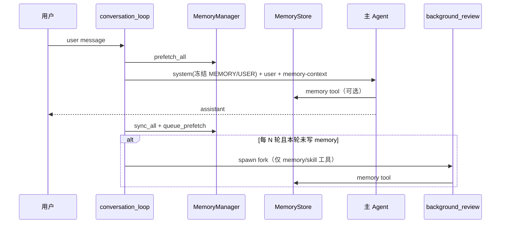

# Hermes Agent 自进化记忆 — 调研笔记（供 letsTalk 讨论）

| 项目 | 内容 |
|------|------|
| 来源 | [hermes-agent](file:///Users/zs/learn/AI/hermes-agent)（本地路径调研） |
| 日期 | 2026-05-29 |
| 状态 | **只读调研，未改 letsTalk 代码** |

---

## 1. 「自进化记忆」在 Hermes 里指什么

Hermes **没有**一个叫「self-evolving memory」的单独模块。产品上的「自进化」是**三层机制叠加**形成的闭环：

1. **内置精选记忆**（`MEMORY.md` + `USER.md`，有字符上限）
2. **可选外部 Memory Provider 插件**（Honcho、Mem0、Holographic 等）
3. **后台周期性 review**（fork 子 Agent，只带 `memory` / `skill_manage` 工具，回顾 transcript 后决定是否写入）

官方表述接近：**Agent 主动记 + 定期后台回顾 + 可选重型后端自动建模**。

---

## 2. 总体架构

```text
┌─────────────────────────────────────────────────────────────┐
│                     AIAgent（主对话循环）                      │
├─────────────────────────────────────────────────────────────┤
│ 写入                                                          │
│  • memory 工具 → MemoryStore → ~/.hermes/memories/*.md       │
│  • 外部 provider 工具 / sync_turn（每轮 user+assistant 同步）   │
│  • background_review（每 N 轮 fork 子 Agent 写 memory/skill）  │
├─────────────────────────────────────────────────────────────┤
│ 读取 / 注入                                                   │
│  • 会话启动：MEMORY/USER 冻结快照 → system prompt（volatile 层）│
│  • 每轮：MemoryManager.prefetch → 注入当前 user message 围栏块   │
│  • 按需：session_search（FTS5）/ provider 语义检索工具          │
└─────────────────────────────────────────────────────────────┘
```

### 2.1 存储分层

| 层 | 位置 | 形态 | 用途 |
|----|------|------|------|
| 内置记忆 | `$HERMES_HOME/memories/MEMORY.md` | Markdown，`\n§\n` 分隔条目 | Agent 笔记：环境、惯例、踩坑 |
| 用户画像 | `$HERMES_HOME/memories/USER.md` | 同上 | 用户偏好、沟通风格 |
| 会话历史 | `$HERMES_HOME/state.db`（SQLite + FTS5） | 全量 transcript | `session_search` 按需 recall |
| 外部 | 依插件 | 各 backend 自定 | 语义检索、自动 conclusion 等 |

### 2.2 关键源码（Hermes 仓库内）

| 文件 | 职责 |
|------|------|
| `tools/memory_tool.py` | `MemoryStore`、memory 工具 schema、威胁扫描、原子写盘 |
| `agent/memory_manager.py` | 编排内置 + 最多 1 个外部 provider；prefetch / sync |
| `agent/memory_provider.py` | 外部 provider 抽象与生命周期钩子 |
| `agent/background_review.py` | **自进化核心**：fork Agent、review prompt、工具白名单 |
| `agent/conversation_loop.py` | nudge 计数、prefetch 注入、post-turn sync、spawn review |
| `agent/system_prompt.py` | 把 MEMORY/USER 快照注入 system prompt |
| `tools/session_search_tool.py` | FTS5 跨会话搜索（零 LLM 成本） |
| `plugins/memory/*` | Honcho、Mem0、Hindsight 等可选后端 |

---

## 3. 数据模型（内置记忆）

### 3.1 两个 Store

- **memory**：Agent 自己的持久笔记（默认上限约 **2200 字符**）
- **user**：用户画像（默认约 **1375 字符**）

条目用 **`§`（section sign）** 分隔，可 multiline；**无条目 ID**，`replace` / `remove` 靠 **子串匹配** `old_text`。

### 3.2 memory 工具操作

| action | 含义 |
|--------|------|
| `add` | 追加条目（exact duplicate 不重复写） |
| `replace` | 用 `old_text` 定位后替换 |
| `remove` | 用 `old_text` 定位后删除 |

Schema 内嵌 **「何时该 save」** 的行为指导（用户纠正、说 remember、项目惯例等）；**明确禁止**把任务进度、已完成工作日志写进 memory（那些靠 `session_search` 查 transcript）。

### 3.3 冻结快照 vs 实时磁盘（重要设计）

`MemoryStore` 维护**两套状态**（见 `memory_tool.py` 模块头注释）：

- **`_system_prompt_snapshot`**：会话加载时冻结，用于 system prompt；**会话内不因 tool 写入而变** → 保 prefix cache 稳定
- **`memory_entries` / `user_entries`**：tool 写入后立即更新并 **persist 到磁盘**

因此：**同一会话里新写入的内置记忆，不会立刻出现在 system prompt 里**，要到下一轮会话或触发 `invalidate_system_prompt()`（如上下文压缩后 reload）才刷新快照。

---

## 4. 记忆何时被创建 / 更新（四条路径）

### 4.1 前景：Agent 主动调 `memory` 工具

主对话中模型认为该持久化时调用；成功写入后 `tool_executor` 会 `MemoryManager.on_memory_write()` 同步到外部 provider（若有）。

主 Agent 当轮若已调 `memory`，**nudge 计数器清零**，避免同一轮再 spawn background review。

### 4.2 背景：每 N 轮 `background_review`（自进化关键）

`conversation_loop.py` 逻辑概要：

- 配置 `memory.nudge_interval`（默认 **10** 个 user turn；**0 = 关闭**）
- 每轮 user turn 计数；达到阈值且本轮响应已交付 → **daemon 线程** spawn fork Agent
- Fork 特点（`background_review.py`）：
  - 继承父 Agent 的 **cached system prompt**（仍命中 prefix cache）
  - **工具白名单**仅 `memory` + `skill_manage`
  - `skip_memory=True`，不写外部 provider，**只写内置 MEMORY/USER 文件**
  - 自身 `_memory_nudge_interval = 0`，防止递归 nudge

Review prompt 聚焦：用户是否透露 persona/偏好/期望行为；有则 `memory` 写入，无则回复 “Nothing to save.”

### 4.3 每轮：外部 provider `sync_turn`

`run_agent.py` 在**非中断**轮次结束后 `_sync_external_memory_for_turn()`：把 user message + assistant response 同步到外部 backend，并 `queue_prefetch` 预热下一轮 recall。

### 4.4 会话边界

- 压缩 / `/new` / gateway 过期等 → `commit_memory_session()`、`on_session_end`
- 压缩前还会 `on_pre_compress`；压缩后 `invalidate_system_prompt()` + `MemoryStore.load_from_disk()` 刷新快照

---

## 5. 记忆如何注入 Prompt（三层）

| 层级 | 注入位置 | 内容 | 特点 |
|------|----------|------|------|
| **Tier 1** | system prompt（volatile） | 冻结的 MEMORY.md + USER.md 快照 | 会话内 byte-stable，利于 prefix cache |
| **Tier 2** | **当前轮 user message** 末尾 | 外部 provider `prefetch` 结果，包在 `<memory-context>` 围栏内 | 每轮可变，但不改 system prompt |
| **Tier 3** | 按需工具 | `session_search`（FTS5）、Honcho search 等 | 不占固定 prompt 预算 |

围栏格式意图：明确标注 **「这是 recall，不是新 user input」**，并对 streaming UI 做 scrubber 防泄露。

另：stable 层还有 `MEMORY_GUIDANCE`（当 memory 工具可用时注入使用说明）。

---

## 6. 「进化」具体指什么（Hermes 没有统一向量 merge 流水线）

| 机制 | 做法 |
|------|------|
| **去重** | `load_from_disk` / `add` 用 `dict.fromkeys`；完全重复 add 返回 success 但不写 |
| **压缩 / 合并** | **靠 Agent 行为**：条目满上限时 tool 报错，prompt 指导用 `replace` 合并；**无**自动 LLM consolidate job |
| **Stale** | 主要靠 prompt 规则；部分 provider（如 Holographic）有 temporal decay / contradict |
| **上下文压缩** | 压缩 session → reload memory 快照；旧 session commit extraction |
| **Skills 并行进化** | background review **同时**可更新 skill 库（procedure）；与 declarative memory 分工 |

内置记忆**不做 embedding**；语义能力交给可选 provider。

---

## 7. 安全与其它工程细节

- 写入 system prompt 的内容做 **regex 威胁扫描**（prompt injection、exfil 等），见 `memory_tool.py` `_scan_memory_content`
- 文件锁 + 原子 replace 写盘
- Gateway 场景：从 `conversation_history` **hydrate nudge 计数**（否则每消息新建 Agent 时 nudge 永远达不到阈值）
- **中断轮次不同步**外部 memory，避免污染

---

## 8. 配置摘要

`~/.hermes/config.yaml`（示意）：

```yaml
memory:
  memory_enabled: true
  user_profile_enabled: true
  memory_char_limit: 2200
  user_char_limit: 1375
  nudge_interval: 10      # 0 = 关 background review
  provider: ""            # honcho | mem0 | ...

skills:
  creation_nudge_interval: 10   # skill review，与 memory 独立计数
```

环境：`HERMES_HOME` → 记忆目录；各 provider 自有 API key。

---

## 9. 与 letsTalk 现状对照

| 维度 | Hermes | letsTalk（当前） |
|------|--------|------------------|
| 持久化位置 | `~/.hermes/memories/*.md` | `.agent/memory/*.md`（`@lets-talk/memory` 包已有 frontmatter） |
| Agent 工具 | `memory` add/replace/remove | `save_memory` / `read_memory`（**默认未注册**） |
| 注入 prompt | system 快照 + user 围栏 prefetch | V1：**不**每轮灌 memory；靠 Pull / grep |
| 后台自回顾 | **每 N 轮 fork review** | **无** |
| 历史 recall | FTS5 `session_search` | Pi jsonl + conversation JSON；无 FTS memory 搜索 |
| 字符/条目上限 | 硬上限强制 curation | memory 包暂无硬上限（需讨论） |
| 外部语义后端 | 插件化单 provider | 无 |
| 写文件 | 仅 memory 工具写 md | `write`/`edit` 限 `.agent/`（刚开放） |

letsTalk 的 **需求清单**（`requirementDraft`）是 **PM 结构化交付物**，与 Hermes 的 **curated 自由文本记忆** 是不同产品线；可并存，不宜混为一个 store。

---

## 10. 若 letsTalk 借鉴，建议拆成三个独立决策（仍待讨论）

### A. 内置 Curated Memory（最接近 Hermes MEMORY.md）

- 单文件或多 topic 文件 + frontmatter（letsTalk 已有 `@lets-talk/memory`）
- **是否**采用「冻结快照进 prompt」vs「仅 Pull」—— Hermes 选前者换 prefix cache；letsTalk V1 选后者换 token
- **是否**设字符/条目硬上限强制 curation

### B. Background Review（Hermes 自进化最 distinctive 的部分）

- 每 N 轮 fork **轻量** Agent（或单轮 structured extraction，不一定 full fork）
- 只写 `.agent/memory/`，不碰 requirementDraft、不碰 workFront
- 与「用户当轮已 save_memory 则跳过 review」同样降重

### C. Recall 分层（Hermes 的 bounded memory + unlimited transcript search）

- **Declarative**：短、精选、进 prompt 或 prefetch
- **Episodic**：全量 transcript → FTS / session_search 按需
- letsTalk 可复用 `.agent/conversations/` + Pi jsonl，不必重复造 transcript store

### D. 暂不建议照搬

- 多 provider 插件生态（M1 过重）
- Skills 库与 memory 并行 self-improvement（letsTalk 暂无 skill 体系）
- 内置记忆无上限 + 全量向量 RAG（与 Hermes「有界 curation」相反）

---

## 11. 流程图（Hermes 一轮对话 + 可选 review）



---

## 12. 开放问题（给 letsTalk 记忆方案评审用）

1. **PM 模式要不要 memory？** 写需求场景更关心清单与代码证据，记忆写什么、谁审核？
2. **快照 vs Pull**：是否接受「本会话新 memory 不进 prompt，下会话才生效」？
3. **Background review 成本**：每 10 轮多一次 LLM 调用，部门内是否可接受？
4. **与 `.agent/hints/` 分工**：hints 人工维护线索 vs memory Agent 自动沉淀，边界在哪？
5. **requirementDraft 会话结束是否 extraction 进 memory？** Hermes 明确不把 task outcome 写 memory；letsTalk 是否要把「定稿需求摘要」单独存？

---

## 13. 延伸阅读（Hermes 仓库内）

- `website/docs/user-guide/features/memory.md` — 用户向说明
- `website/docs/user-guide/features/memory-providers.md` — 外部 provider 对比
- `tools/memory_tool.py` 文件头 — 冻结快照设计原文
- `agent/background_review.py` — review prompt 与 fork 约束

---

*本文仅调研 Hermes 实现，供 letsTalk 记忆方案讨论；落地前需结合 [CONTEXT_MANAGEMENT_V1.md](./CONTEXT_MANAGEMENT_V1.md) 与 `.agent/memory/` 约定单独开 PRD。*
