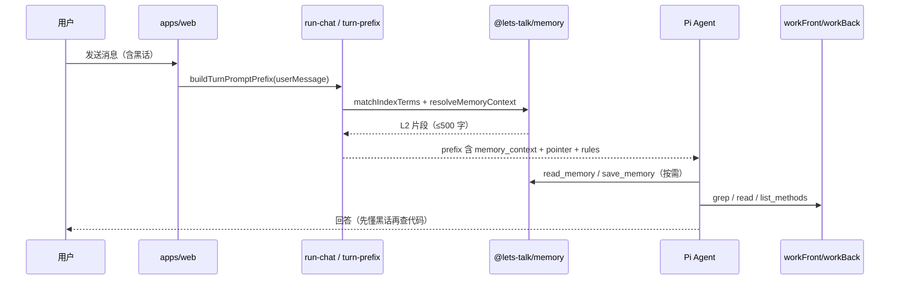
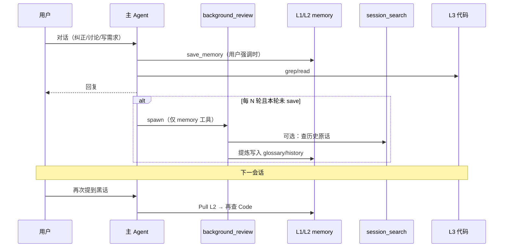

# letsTalk 记忆体系 — 构筑说明与未来展望

| 项目 | 内容 |
|------|------|
| 版本 | 1.1 |
| 日期 | 2026-05-31 |
| 状态 | **V1 Phase A 已落地**（USER/CORE Tier 1）；自进化（Hermes 式）为 V1 P2+ |
| 关联 | [MEMORY_V1.md](./MEMORY_V1.md)（**当前规格**）· [MEMORY_V0.md](./MEMORY_V0.md) · [HERMES_MEMORY_REFERENCE.md](./HERMES_MEMORY_REFERENCE.md) · [AGENTS.md](../AGENTS.md) |

---

## 1. 为什么要有记忆体系

letsTalk 服务的不是「写一段就忘」的通用编程助手，而是 **长期绑定一个 ERP 仓库** 的 Agent：同一套黑话、同一批菜单、同一类 Controller 会反复出现。若没有跨会话记忆，每次对话都会：

- 把「枚举字典」误解成 `sys_menu`
- 重复解释「收支明细 ≠ 订单状态机」
- 在 PRD 模式里丢失「上次为什么改删除逻辑」的脉络
- 把接口清单、菜单树 **复印进 prompt**，既费 token 又很快过时

与此同时，letsTalk 已经有 **需求清单**（`requirementDraft`）承担「当前这单交付」——记忆 **不能** 替代清单，也不能变成第二个代码库。

因此记忆体系要回答三个问题：

1. **Agent 如何跨会话「听懂黑话」？**
2. **如何记住「改过的原因」而不缓存活代码？**
3. **如何在几乎不增加 UI、不明显吃 token 的前提下做到以上两点？**

---

## 2. 我们要解决的核心问题

| 问题 | 典型症状 | 记忆层职责 |
|------|----------|------------|
| **黑话歧义** | 「字典」「明细」在代码里有多处对应 | L1 索引 + L2 glossary |
| **变更失忆** | 「上次删用户为什么改成软删」没人记得 | L2 history |
| **代码复印件** | memory 里堆 REST 列表，一改代码就全错 | L0 禁止 + L3 活查 |
| **任务 vs 共识混淆** | 当前 PRD 条目被写进「永久记忆」 | L4 清单 vs L2 边界 |
| **Token 膨胀** | 每轮灌整本 memory | Pointer + 命中才 Pull |
| **错误沉淀** | Agent 记错且无人纠正 | stale 警告 + 以代码为准 |

**设计立场（与 Claude Code / Hermes 都不同的一点）：**

- letsTalk 是 **ERP 结对 + PM 写需求** 产品，memory 优先服务 **业务语义与变更脉络**，不是通用「用户偏好笔记本」。
- **代码永远是 L3 权威**；memory 只存「怎么理解、怎么搜」，不存 API 快照。

---

## 3. 整体构筑：L0–L4 五层模型

我们借用 Claude Code 的「规则 + 索引 + topic + 代码」思路，并 **显式拆成五层**，避免 Agent 把什么都往一个文件里塞。

```text
┌─────────────────────────────────────────────────────────────────┐
│ L0  规则层     AGENTS.md + Rule Push（arch_rules / pm_rules）    │
│               「怎么工作、记忆是什么角色」— 人维护为主              │
├─────────────────────────────────────────────────────────────────┤
│ L1  索引层     .agent/memory/INDEX.md                           │
│               「黑话 → 文件」纯表，每行 ≤120 字，禁止正文         │
├─────────────────────────────────────────────────────────────────┤
│ L2  主题层     .agent/memory/topics/*.md                        │
│               glossary（含义/误区/怎么查）· history（变更脉络）   │
├─────────────────────────────────────────────────────────────────┤
│ L3  活数据     workFront / workBack / menu-map / grep / read    │
│               代码与菜单 — 系统提供，不写入 memory               │
├─────────────────────────────────────────────────────────────────┤
│ L4  任务态     requirementDraft（PRD 需求清单）                  │
│               当前单交付 — 非 memory                             │
└─────────────────────────────────────────────────────────────────┘

依赖方向：L0 约束 L1/L2 怎么用 → L1 指向 L2 → L2 指向 L3 的搜法 → L4 独立
```

### 3.1 与 Claude Code memory 的对照分析

**结构对应：**

| Claude Code | letsTalk |
|-------------|----------|
| `CLAUDE.md`（人写规则） | **L0** `AGENTS.md` + Rule Push |
| Auto memory `MEMORY.md` | **L1** `INDEX.md`（我们更瘦：禁止长摘要） |
| Topic 文件 | **L2** `topics/*.md` |
| grep / read | **L3** |
| （无直接对应） | **L4** requirementDraft |

**关键行为差异：**

| 维度 | Claude Code | letsTalk V0 | 影响评估 |
|------|-------------|-------------|----------|
| **注入方式** | 相关记忆自动注入 system prompt，模型无需主动调用 | Agent 须自主决定调 `read_memory` / `resolve_memory_terms`，或依赖服务端子串匹配静默 Pull | **核心差距**：letsTalk 的读取链路每一步都可能断裂，实际查全率远低于 Claude Code |
| **写入门槛** | 宽松笔记风格，"存了再说" | 严格校验（L0 DO/DON'T + `validateSaveMemoryContent` 拒绝 REST 清单） | 各有适用场景：ERP 场景需要防垃圾，但当前 letsTalk 门槛过高导致记忆稀疏 |
| **匹配方式** | 语义检索 + 重要性排序 | 纯子串匹配 `message.includes(term)` | letsTalk 在中文场景下漏报率高，同义词/近义词完全无法命中 |
| **优先级排序** | 按重要性和时效性排序，context 窗口优先保留关键记忆 | 无序返回，按 INDEX 出现顺序 | context 紧张时关键记忆可能被不重要的挤出 |
| **后台整理** | background review 整合碎片 | 无（计划中） | 当前 memory 文件只增不改，重复/碎片条目累积 |
| **用户画像** | 自动学习用户偏好 | 无 | 长期使用后个性化不足 |

**值得说明的几点：**

1. **自动注入在 ERP 场景不一定全盘适用**。Claude Code 面向通用编程，上下文窗口充足时可承载较多 memory；letsTalk 面向的 ERP 仓库更大（可能数千个 Java 文件），"命中才 Pull" 的设计在 token 效率上仍然正确。问题在于当前的**注入量太小**（≤500 字符截断）且查询**召回太差**（纯子串）。

2. **严格写入门槛有其合理性**。ERP 业务黑话一旦记错（如"字典 = sys_menu"），后果比通用编程辅助记错 API 更严重。`validateSaveMemoryContent` 的防 REST 清单机制应保留，但 draft 级别的写入应大幅降低门槛。

3. **letsTalk 缺少的"后台 Review"和"自动注入"是两个独立问题**。前者解决记忆碎片整理，后者解决查全率。V1 应优先解决查全率（匹配 + 注入），其次才是整理（review）。

### 3.2 与 Hermes 的对应（为「自进化」留接口）

| Hermes 机制 | letsTalk V0 | 未来方向 |
|-------------|-------------|----------|
| `MEMORY.md` 精选笔记 | L2 topics + L1 索引 | 保持有界 curation |
| `USER.md` 用户画像 | 暂无 | V2 可选 `.agent/memory/USER.md` |
| 每轮 prefetch 注入 | turn-prefix 命中 Pull | 保留，可加语义检索 |
| `background_review` 后台回顾 | **无** | **V1 核心目标** |
| `session_search` FTS | Pi jsonl + conversation | V1 轻量 FTS |
| 外部 Memory Provider | 无 | V2+ 按需插件 |

---

## 4. 运行时数据流（V0 已实现）



### 4.1 读取策略：命中才 Pull（省 token，但查全率有代价）

| 时机 | 行为 |
|------|------|
| 会话创建 | `AGENTS.md` + `appendSystemPrompt` → **Pi system prompt**（跨会话规则） |
| 每轮用户消息 | 仅 `<context />` 指针 + 按需 `<memory_context>` + PRD 清单摘要 |
| 每轮用户消息 | 服务端**子串匹配 + 中文连续字重叠** INDEX → 命中则静默注入 `<memory_context>`（≤2000 字符，按 confidence → updated_at 排序） |
| Agent 主动 | `read_memory` · `list_memory_index` · `resolve_memory_terms` |
| ~~Rule Push~~ | 已移除：不再把 arch/pm rules 塞进 user 前缀 |

**当前静默注入的局限（V0）：**

- **匹配方式**：`message.includes(term)` 纯子串 + 中文连续字重叠。INDEX 多行覆盖别名。同义词/拼音变体等仍无法命中。
- **注入量**：最多 2000 字符（2026-05-31 从 500 上调）。超长条目会截断。
- **排序**：已按 confidence（verified > draft）→ updated_at 排序（2026-05-31 新增）。
- **链路断裂**：即使上述全部正常，Agent 收到的只是一个 `<memory_context>` 围栏块——模型"可以选择"忽略它，因为不是 system prompt 中的硬指令。

这与 Claude Code「相关记忆自动注入 system prompt」不同；我们更接近 **V1 上下文 Pointer + Pull** 哲学：平时几乎零 token 成本，但**查全率依赖于匹配质量和 Agent 配合度**——两者在 V0 中均不可靠。

### 4.2 写入策略：双写契约

一次成功的 `save_memory` **必须**：

1. 写入或更新 **L2** `topics/{kind}-{slug}.md`
2. 同步 **L1** INDEX 中每个 topic / alias 对应的一行
3. 禁止只写 L2 留下孤儿文件
4. 禁止在 INDEX 写正文或 API 列表

**触发（L0 DO）：** 用户强调、纠正、当事实陈述（「记住…」「我们说的 X 就是 Y」）。  
**不触发（L0 DON'T）：** 仅完成当前清单、仅查到代码路径、未经确认标 `verified`。

### 4.3 已实现模块一览

| 模块 | 路径 | 职责 |
|------|------|------|
| 存储与匹配 | `packages/memory` | INDEX 解析/同步、`saveMemory`、`readMemory`、`matchIndexTerms`、`resolveMemoryContext` |
| Agent 工具 | `packages/agent-runtime/src/memory-tools.ts` | `save_memory` · `read_memory` · `list_memory_index` |
| Pull 工具 | `packages/agent-runtime/src/context-pull-tools.ts` | `resolve_memory_terms` |
| 静默注入 | `packages/agent-runtime/src/turn-prefix.ts` | 用户消息命中 → `<memory_context>` |
| 规则注入 | `packages/context/src/memory-policy.ts` | arch/pm 记忆要点 |
| 落盘目录 | `.agent/memory/` | `INDEX.md` · `topics/*.md` |

**环境变量：**

- 记忆工具 **默认开启**；`LETS_TALK_MEMORY_TOOLS=0` 关闭
- `.agent/` 写入默认开启；`LETS_TALK_AGENT_WRITE=0` 关闭

**UI：** 无记忆侧栏；Transcript 工具折叠中可见 save/read（后台能力）。

---

## 5. 已经解决的问题（V0 验收口径）

| # | 问题 | V0 如何解决 |
|---|------|-------------|
| 1 | Agent 不懂项目黑话 | INDEX + 子串匹配 + 静默 Pull L2 |
| 2 | 写入后 INDEX 与 topic 不一致 | `save_memory` 强制 L1+L2 双写 |
| 3 | memory 里堆 API 复印件 | L0 DON'T + L2 模板（怎么查，不写结果） |
| 4 | 记忆与需求清单混淆 | L4 独立；pm_rules 明确勿塞进 replaceItems |
| 5 | 每轮灌 memory 吃 token | 命中才 Pull；INDEX 极短 |
| 6 | 代码改了 memory 仍当真理 | `sources` + mtime stale 警告；以代码为准 |
| 7 | legacy 扁平 md 难维护 | 迁移示例：`order-state-machine` → `topics/history-detail-ledger.md` |
| 8 | explore/prd 行为不一致 | 共用 memory；prd 额外 pm_rules 指引 |

**可手动验证的路径：**

1. 说「记住：枚举字典不是 sys_menu…」→ Agent 调 `save_memory` → INDEX 与 L2 同时存在  
2. 再说「枚举字典怎么查」→ prefix 或 read 先给 L2，再 grep，不默认搜 menu  
3. PRD 模式：清单仍走 `update_requirement_draft`，memory 不占 SSE 字段  

---

## 5.1 ShareAI s09 边界（V0.1 · 已落地）

参考 [ShareAI · s09 记忆系统](https://learn.shareai.run/zh/s09/)，在 V0 之上补充 **存储纪律**（2026-05-30）：

| 能力 | 实现 |
|------|------|
| **可推导性闸门** | L0 首条原则 + `save_memory` guideline；`validateSaveMemoryContent` 警告/拒绝 REST 清单 |
| **即使用户说 remember 也二次提炼** | guideline + 拒绝 ≥8 条 REST 行写入（≥4 条警告） |
| **正反馈可记** | history 可写用户认可的做法 |
| **忽略 memory** | `isMemoryIgnoredMessage` → 跳过 Pull、prefix 带 `<memory_suppressed />` |
| **memory 是指针** | read 输出提示；Pull 后仍须 grep/read |
| **四格边界表** | AGENTS.md：memory / requirementDraft / 当轮 plan / L0 |

**可自测：**

1. 发「收支明细怎么删」→ Transcript/debug 里 context 应含 `<memory_context>`（若 INDEX 命中）  
2. 发「不要参考记忆，收支明细怎么删」→ 无 `<memory_context>`，有 `<memory_suppressed />`  
3. `save_memory` 正文塞 8 条以上 `GET /xxx` → 工具应 **拒绝** 并提示改写；4～7 条给出警告  

---

## 6. 尚未解决 / 已知局限

> 以下局限按严重程度排列。前 4 条是**架构级问题**，直接影响 V0 是否真正可用；后 4 条是增量改进。

### 🔴 架构级（影响记忆系统的实际效用）

| # | 局限 | 说明 | 具体表现 |
|---|------|------|----------|
| 1 | **查全率无保障** | 记忆的读取链路有三道断裂点：INDEX 子串匹配能否命中 → 命中后注入量是否够 → Agent 是否采纳 | 写了一堆记忆，但用户换种说法提问就不命中；静默注入只有 500 字符；Agent 可以选择忽略 `<memory_context>` 围栏。每一步都是"可能不执行" |
| 2 | **中文匹配仍不完善** | 基础匹配已支持中文连续字重叠 + INDEX 多行覆盖别名，但无分词、无拼音、无语义 | 用户说"字典表"可命中"枚举字典"（"字典"重叠），但"enum dict""zidian"等仍不命中。查全率有改善但仍不理想 |
| 3 | **写屏障过高 → 记忆稀疏 → 负循环** | Agent 被 L0 规则和 `validateSaveMemoryContent` 教育成"能不写就不写" | 写的内容少 → INDEX 稀疏 → 命中率更低 → Agent 觉得 memory 没用 → 更不写。结果是一个理论上能工作的系统在实际运行中很少产生效益 |
| 4 | **命中结果无优先级排序** | 2026-05-31 已新增 confidence（verified > draft）→ updated_at 排序。但记忆暂不参与全局 context 优先级调度 | 同批注入时已优化排序；跨 session、跨类型的全局排序仍未支持 |

### 🟡 增量改进（可后续补充）

| # | 局限 | 说明 | 优先级 |
|---|------|------|--------|
| 5 | **无后台 review** | 只有用户触发或 Agent 当轮主动 save；记忆只增不改，碎片累积 | 中（整理问题，不影响查全） |
| 6 | **无跨会话 transcript 检索** | 不能 FTS recall 历史对话原话 | 中 |
| 7 | **L0 不自动演进** | `AGENTS.md` 仅人维护 | 低 |
| 8 | **无审核流** | Agent 写 memory 即落盘，错误需人工改 md | 低 |

### 关于"故意的 V0 取舍"的反思

当前 V0 的取舍逻辑是：**先保证"写"的正确性，再优化"读"的召回率**。实际使用表明这个顺序需要重新审视：

- "写"做得好（INDEX + L2 双写、反模式校验）但"读"召回差 → 记忆系统在运行中**实际不产生价值**
- 正确方向：**先保证每轮能可靠地让模型感知到相关记忆**，再逐步收紧写入质量控制
- 具体来说：匹配应至少覆盖同义词和中文重叠（已实施）、注入量上限从 500 提至 2000（已实施）、Agent 可选调用应变为默认注入——这些改动不破坏现有写入校验，风险可控

---

## 7. 未来展望：走向 Hermes 式自进化

目标不是照搬 Hermes，而是在 **L0–L4 边界已清晰** 的前提下，增加 **「Agent 会自己整理记忆」** 的闭环，同时保持 letsTalk 的产品约束（无显眼 UI、不污染需求清单、代码为准）。

### 7.1 自进化在 Hermes 里到底是什么

Hermes 没有单一「self-evolving memory」模块，而是三层叠加：

1. **前景写入**：主 Agent 调 `memory` 工具（用户纠正、remember、发现惯例）
2. **背景回顾**：每 N 轮 fork 轻量子 Agent，**仅** memory/skill 工具，读 transcript 决定是否写入
3. **Episodic recall**：全量 transcript 进 SQLite FTS，`session_search` 按需查

「进化」**不是**自动向量 merge，而是：**定期回顾 + 有界存储 + replace 合并 + 去重**。

### 7.2 letsTalk 建议路线（修正后）

根据 §6 的反思，修正后的路线图将 **查全率优化** 置于 **后台整理** 之前：

```text
V0（当前）  人工/当轮 save + 子串匹配 Pull（≤500 字符，无排序）
     ↓
V1 P1       增强自动注入 + 改进匹配 + 降低写屏障（本阶段目标：查全率）
     ↓
V1 P2       Background Review + Session Search（Hermes 核心借鉴，整理碎片）
     ↓
V2          可选语义 Provider + USER 画像 + L0 提议审核
     ↓
V3          Skill 库与 memory 并行进化（若产品有 skill 体系）
```

#### 阶段 V1 P1 — 增强自动注入与匹配（优先于 Background Review）

**修正理由：** Background Review 解决的是"写了但没整理"的问题。但如果记忆**本来就没被读到**（查全率低），整理现有记忆并不能让模型开始用它。必须先让模型**每轮都能可靠感知到相关记忆**，再去做碎片整理。

##### 目标

每轮对话**静默且自动**地向模型注入相关记忆，不依赖 Agent 主动调用工具。

##### 具体项

| 项 | 当前 | 目标 |
|----|------|------|
| 静默注入字符上限 | ≤500 字符 | ≥2000 字符（保证完整 glossary 条目可见） |
| 命中排序 | 无序（文件顺序） | confidence（verified > draft）→ updated_at（最近优先） |
| 匹配方式 | `message.includes(term)` 纯子串 | 中文连续字重叠（≥2 字）+ INDEX 多行覆盖别名 |
| 写入门槛（draft） | 严格（≥4 条 REST 路径拒绝） | 宽松（≥8 条才拒绝；draft 应"存了再说"） |
| Agent 记忆工具行为 | "能不写就不写" | "有疑问先写 draft" |

##### 评估方式

- 通过率：INDEX 中有 10 个高频词条，用户以 5 种不同说法提问 → 至少 3 种应命中（V0：仅 1-2 种或全部不命中）

#### 阶段 V1 P2 — Background Review（原 V1 首项）

**目标：** 用户没说「记住」，但对话里出现了 **稳定共识**，也能沉淀到 L2。

| 项 | 设计要点 |
|----|----------|
| 触发 | 每 **N** 个 user turn（如 10，可配置 `LETS_TALK_MEMORY_REVIEW_INTERVAL`） |
| 执行体 | fork **轻量子 Agent** 或单轮 structured extraction（不一定 full Pi session） |
| 工具白名单 | 仅 `save_memory` / `read_memory` / `list_memory_index` |
| 输入 | 最近 K 轮 transcript 摘要 + 现有 INDEX/L2 列表 |
| 输出 | 0~1 条 glossary/history 写入，或显式「Nothing to save」 |
| 降重 | 若本轮用户已触发 `save_memory`，**跳过** review |
| 边界 | **不写** requirementDraft、**不写** workFront/workBack、**不改** AGENTS.md |

**Review prompt 应问的问题（示意）：**

- 用户是否纠正了某个黑话含义？
- 是否出现跨会话仍有价值的业务事实（非本单任务进度）？
- 是否应合并/替换已有 L2 条目（而非追加重复 topic）？

**落盘模块（规划）：**

```text
packages/agent-runtime/src/memory-background-review.ts
packages/conversation/src/transcript-search.ts   # FTS over jsonl
```

#### 阶段 V1 P2 — Session Search（Episodic 层，与 Background Review 并列）

**目标：** 「上周讨论过删除逻辑吗」→ FTS 查 `.agent/conversations/` + Pi jsonl，**零额外 LLM**。

| 项 | 设计要点 |
|----|----------|
| 存储 | 已有 conversation JSON + Pi jsonl，不重复造库 |
| 工具 | `search_past_sessions(query)` → 片段 + sessionId |
| 与 L2 分工 | search 返回 **原话**；L2 存 **提炼后的共识** |
| PM 模式 | 默认可搜；写入 L2 仍受 DON'T 约束 |

#### 阶段 V2 — 语义检索与用户画像

| 能力 | 说明 |
|------|------|
| **USER.md** | 沟通风格、PM 偏好（短句/表格）、常用模块 |
| **可选 Provider** | 仅当 INDEX 子串不够时启用 embedding 检索（插件化，默认关） |
| **L0 提议流** | Agent 提议更新 `AGENTS.md` → 人确认 → 落盘（避免 Agent 自改规则） |
| **硬上限** | L2 单 topic / INDEX 总行数上限，触顶强制 merge |

#### 阶段 V3 — Skill 与 Memory 并行（可选）

若 letsTalk 引入 **Skill**（多步流程、发布 checklist），可像 Hermes 一样让 background review **同时**维护 skill 库；memory 存 declarative 事实，skill 存 procedural 步骤。

---

### 7.3 自进化流程图（目标态）



---

### 7.4 自进化必须守住的底线（继承 V0）

无论 Hermes 多强大，letsTalk 增加自进化时 **不放宽** 以下约束：

1. **L2 不写 API/菜单复印件** — review 产出也要过 schema/guideline 校验  
2. **L4 需求清单不自动 extraction 进 memory** — 定稿摘要若要存，需单独产品与审核  
3. **L0 不自动改** — 规则演进必须经人确认  
4. **后台无 UI** — review 结果仅 Transcript / 文件 diff 可审计  
5. **以代码为准** — review 写入必须带 `sources` 或标 `draft`  

---

## 8. 开放问题（评审用）

1. **Background review 间隔 N**：10 轮是否合适？PRD 长会话 vs explore 短问是否区分？  
2. **PM 模式 review**：是否只写 history（变更原因），禁止 Agent 自造 glossary？  
3. **错误 memory 治理**：是否需要「memory PR」或管理员只读面板（仍非主 UI）？  
4. **定稿 PRD 是否进 L2**：作为 history 一条，还是独立 archive 目录？  
5. **多 worktree / 多人**：`.agent/memory/` 走 git 合并，冲突策略？  

---

## 9. 文档索引

| 文档 | 用途 |
|------|------|
| **本文** | 构筑动机、分层、已解决/未解决、自进化路线图 |
| [MEMORY_V1.md](./MEMORY_V1.md) | **V1 可成长助手**（USER/CORE + jargon · 当前实现） |
| [MEMORY_V0.md](./MEMORY_V0.md) | V0 实现规格与验收（归档） |
| [HERMES_MEMORY_REFERENCE.md](./HERMES_MEMORY_REFERENCE.md) | Hermes 调研原文 |
| [CONTEXT_MANAGEMENT_V1.md](./CONTEXT_MANAGEMENT_V1.md) | Pointer / Rule Push / 需求清单 |
| [.agent/memory/README.md](../.agent/memory/README.md) | 目录约定与写入说明 |
| [AGENTS.md](../AGENTS.md) | L0 规则与 DO/DON'T |

---

## 10. 一句话总结

**letsTalk 记忆体系 V0** 用 **L0–L4 分层** 把「规则、黑话、变更、代码、当前需求」拆开，用 **INDEX + topics 双写** 和 **命中 Pull** 解决 ERP 场景下的黑话与失忆问题，且 **不抢需求清单、不复印代码**。

**V1 修正方向：** 优先解决 **查全率**——增强自动注入、改进匹配算法、降低 draft 写入门槛，让记忆从"Agent 可选工具"变为"每轮可靠浮现的上下文"，在此之后再叠 Background Review 做碎片整理。
