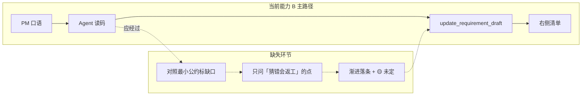

# PM 需求整理能力缺口分析与改进方案

| 项目 | 内容 |
|------|------|
| 文档类型 | 产品 + 技术联合分析 |
| 日期 | 2026-06-01 |
| 读者 | 产品、Agent 提示词、前后端实现 |
| 关联 | [PM_REQUIREMENT_ASSISTANT.md](./PM_REQUIREMENT_ASSISTANT.md) · [PM_TEST_RECORD.md](./PM_TEST_RECORD.md) · [PROMPT_OPTIMIZATION_V2.md](./PROMPT_OPTIMIZATION_V2.md) |

---

## 1. 项目两大能力（共识对齐）

letsTalk 现阶段服务 **不懂代码的 PM**，围绕同一套代码库（`workFront/` + `workBack/`）做两件事：

| 能力块 | 用户诉求 | 典型问法 | 当前模式 |
|--------|----------|----------|----------|
| **A. 读码解说** | 「这个按钮点了会发生什么？」 | 「删除用户是物理删还是禁用？」「批量提交走哪个接口？」 | 探索模式 + 锚点 |
| **B. 需求收成** | 「我要改 XX，帮我问清楚、写明白」 | 「支付计划要能批量审批」「额度算错了要自动算」 | 需求整理模式 + 右侧清单 |

```text
                    ┌─────────────────────────────────────┐
                    │           letsTalk 会话              │
                    └─────────────────────────────────────┘
           能力 A（已较强）                    能力 B（待加强）
    ┌──────────────────────────┐    ┌──────────────────────────┐
    │ 锚点聚焦 → grep/read     │    │ 口语输入 → 清单条目       │
    │ → 业务语言解释现状       │    │ → asIs/toBe/验收         │
    │ → 可多轮深挖代码         │    │ → 导出 PM 定稿 / 研发附录 │
    └──────────────────────────┘    └──────────────────────────┘
              ↑                                    ↑
         工具循环天然适配                      缺「最小公约」柔性收敛
```

**你的判断与代码、测试记录一致**：能力 A 的闭环（锚点 → 读码 → 回答）与 Pi 工具循环高度契合；能力 B 有清单 UI 和数据结构，但 **Agent 行为更像「速记员」而非「帮 PM 和研发对齐最小公约的搭档」**。

---

## 2. 能力 A 为什么做得好

### 2.1 机制匹配

| 要素 | 作用 |
|------|------|
| 锚点（菜单 / .vue / .java） | 缩小搜索范围，PM 用业务语言选位置 |
| 只读工具链 | `grep` / `read` / `list_methods` / `read_method` 形成可验证闭环 |
| AGENTS.md 读码规范 | Controller 先 list 再 read_method，避免幻觉 |
| 探索模式无清单压力 | Agent 专注「查清楚再说」，不被写 JSON 分散 |

### 2.2 成功模式（可复用到能力 B）

```text
PM 提问 → Agent 定位代码 → 读关键路径 → 用业务话复述 → PM 可继续追问
```

这一模式在 `docs/examples/requirement-export-v0.5-sample.md` 的 **「现在怎样」** 格子里已有目标样态（例如「点击复制后直接弹窗，不校验启用状态」），说明 **读码 → 业务化 asIs** 的产品方向是对的。

---

## 3. 能力 B 当前实现了什么

### 3.1 已有资产（不应推倒重来）

| 层级 | 现状 | 评价 |
|------|------|------|
| **UI** | 左对话 + 右 `RequirementCanvas`（条目、缺格 🟡、`blockingQuestion`、`openQuestions`） | 骨架完整 |
| **数据** | `RequirementDraftState`：items + fields + openQuestions + blockingQuestion + readyToFinalize | 字段够用，与 v0.4「business + techTraces」仍有语义差距 |
| **工具** | `get_requirement_draft` / `update_requirement_draft`（乐观锁 draftRevision） | 能同步右侧 |
| **校验** | modify 须 page 或 control；合并「纯后端条」进 codePaths；过滤 PM 界面技术词 | 有工程护栏 |
| **导出** | PM 定稿 + lazy 研发附录（`generateDevAppendix`） | 主/次分离正确 |
| **Prompt** | `PM_PRD_RULES`：清单协作 + 正反例 + 导出触发词 | **偏「怎么写清单」，弱「什么时候该问」** |

### 3.2 产品文档里的设计意图（尚未充分落地）

`PM_REQUIREMENT_ASSISTANT.md` 明确：

- **观察 → 推演 → 收成** 三条能力
- **最多 1 个阻断问题**，其余缺口在右侧标 🟡，不问卷
- PM 一件事 = 清单 1 条；技术进 `codePaths` / 研发附录，不进业务格

但 `PM_PRD_RULES`（`packages/context/src/prompt/pm-prd.ts`）当前几乎只规定 **清单字段怎么填**，没有规定：

1. **最小公约**是什么、何时算「够用」（见 §5）  
2. 读码后如何把 **代码发现** 填 asIs / codePaths，而非写进对话或猜 toBe  
3. 何时 **该问** vs **标 🟡 即可**（避免问卷，也避免瞎猜定稿）  
4. 对话正文 vs `codePaths` 的分工  

---

## 4. 缺口诊断（根因）

### 4.1 实测暴露的问题（`PM_TEST_RECORD.md`）

基金支出 / 支付计划场景首轮测试：

| 现象 | 根因归类 |
|------|----------|
| PM 一句话 Agent 就产出 2 条完整需求 | **把猜测当定稿**；未用 🟡/pending 标未定项 |
| 未追问「可用额度」计算口径 | **该问没问**：toBe 含计算规则但 PM 未说过——属公约缺口 |
| 对话出现 `submit()`、校验链 | **对话/清单分工未 enforced**；探索式分析与收成式字段混在一起 |
| 问了省份但没问具体页面 | 锚点/菜单引导有，**场景完整性 checklist 无** |

### 4.2 结构性根因（比单条 prompt 更深）



| # | 根因 | 说明 |
|---|------|------|
| R1 | **Prompt 不对称** | 探索模式：「查清楚」；PRD 模式：「维护清单」→ 模型倾向 **写满格子** 而非 **标缺口** |
| R2 | **缺「最小公约」锚点** | Agent 不知道「写到什么程度算够用」；要么早定稿，要么该问的不问 |
| R3 | **读码贡献未入公约** | asIs / codePaths 应由 Agent 读码填；现状是分析散落对话或 toBe 里瞎猜 |
| R4 | **追问无优先级** | 未区分「可后补 openQuestions」与「必须问清否则研发必返工」 |
| R5 | **正反例只覆盖写法** | title/asIs 有 ✓✗，缺「何时标 pending」「何时才 blockingQuestion」 |
| R6 | **v0.4 数据分层未完全落地** | 仍用扁平 `fields[]` + `codePaths`；techTraces 旁路弱，Agent 易把分析写进对话 |

### 4.3 与目标样例的差距

`requirement-export-v0.5-sample.md` 中一条 **成熟需求** 的特征：

- **toBe**：5 步编号，含分支（停用 / 启用）
- **acceptance**：可逐条点击验证
- **asIs**：来自读码，无类名

要达到这种密度，通常需要 **多轮 PM 确认**（弹窗顺序、停用文案、是否删原方案等）。当前系统 **一轮口语 → 两条结构化需求** 无法自然收敛到该质量。

---

## 5. 北极星：最小公约（柔性，非阶段机）

### 5.1 和旧讨论里「最小公约」的区别

`PM_ASSISTANT_DISCUSSION_BRIEF.md` 曾 **废止** 的是一套 **重产品壳**：八章定稿、双向叠层、正式公约文档流程——与 v0.4「少就是好、文档可选」冲突。

本文说的 **最小公约** 是另一层含义：

```text
PM 和研发在开工前，最少要对齐什么 —— 用右侧清单 + 对话渐进收敛，而不是走审批流。
```

| 废止的（不要做） | 本文倡导的（要做） |
|------------------|-------------------|
| 固定章节 PRD、就绪评分 | 清单几格业务字段 + 🟡 缺格 |
| 首轮禁止写清单、必须答完才落条 | **可以早落条**，未定项标 pending / 留空 |
| 八维 checklist 逐条问卷 | **只问**猜错会返工的点；其余 openQuestions |
| 研发与 PM 同屏双工作台 | PM 定稿为主；研发线索在 codePaths / 导出附录 |

### 5.2 最小公约：两边各需要什么

**PM 侧（定稿权在 PM）** — 业务格够用即可：

| 格 | PM 要回答什么 | 可以后补吗 |
|----|---------------|------------|
| page / control | 改哪 | 有锚点时可 Agent 建议，PM 一句确认 |
| toBe | 希望改成什么 | 可先写主干，细节 pending |
| acceptance | 怎么验收 | 常需多轮；缺了标 🟡，不阻塞对话 |
| asIs | 现在怎样 | **Agent 读码填**；PM 只需说「对/不对」 |

**研发侧（开工最低信息）** — 不要求 PM 懂代码，但交付物里要有：

| 需要 | 谁提供 | 落在哪 |
|------|--------|--------|
| 现状锚定（避免重复造轮子） | Agent 读码 | asIs + codePaths |
| 改动意图无歧义 | PM | toBe |
| 至少 1 条可测验收 | PM + Agent 帮写 | acceptance |
| 规则/边界未定时标出 | Agent 识别 | openQuestions，**勿写进 toBe 当事实** |
| 代码入口线索 | Agent 读码 | codePaths；导出附录 lazy 补充 |

**公约成立的判据**（与 v0.4 §3.4 一致，不新增状态机）：

```text
toBe + acceptance 有内容，且 toBe 里没有 Agent 替 PM 猜的业务规则。
有锚点时 asIs 已读码填写（或 PM 明确说「不用管现状」）。
右侧 🟡 只表示「还能更好」，不表示「失败」。
```

### 5.3 Agent 行为：公约驱动，而非流程驱动

```text
                    ┌─────────────────────────┐
                    │      最小公约（够用）     │
                    │  PM 认 toBe/验收         │
                    │  研发认 asIs+入口+无瞎猜  │
                    └─────────────────────────┘
                              ↑
         ┌────────────────────┼────────────────────┐
         │                    │                    │
    读码填 asIs          渐进 update            只问高代价缺口
    codePaths            pending/🟡            ≤1 blockingQuestion
         │                    │                    │
         └────────────────────┴────────────────────┘
                              ↑
                         PM 口语（可乱、可短）
```

**柔性原则**（避免死板）：

1. **可以第一轮就 update 清单** — 但只写 PM 已说的；Agent 推论的 toBe 规则用「待确认」或留空，**禁止**写成定稿语气。
2. **blockingQuestion 是稀缺资源** — 仅当「不问清楚，研发按当前 toBe 做几乎必返工」时占用；与 v0.4「最多 1 问」一致。
3. **openQuestions + 🟡 是默认** — 大部分缺口不必当场问完；PM 看着右栏想起来再补。
4. **对话像同事，不像表单** — 先一句现状（读码），再一句「有几点还不确定，最要紧的是…」；不必声明「发现阶段」。
5. **技术不进 PM 正文** — 读码分析进 codePaths；这是公约里 **Agent 的分工**，不是额外流程。

**何时该问 vs 何时只标 🟡**（内置优先级，非外露 checklist）：

| 情况 | 做法 |
|------|------|
| 缺 acceptance，但 toBe 已清楚 | 标 🟡；对话可顺带问「怎样算做完」 |
| toBe 含 **计算/权限/批量失败策略** 等 PM 从未提过的规则 | **blockingQuestion** 或 toBe 写「待确认：…」 |
| 缺 page，但有锚点 | Agent 填 page，不必问 |
| 探索模式刚读过代码 | 切 PRD 后直接复用填 asIs，不重复 grep |

### 5.4 改进目标（重述）

一句话：**帮 PM 和研发收敛到「最小公约」——清单是共用的白板，Agent 负责读码贡献与防止瞎猜定稿，对话保持短、自然、可打断。**

| 维度 | 目标行为 |
|------|----------|
| 对话节奏 | **渐进落条**；未定 = pending/🟡，不是禁止写清单 |
| 问题质量 | 少问但问在刀刃上；其余 openQuestions |
| 语言分层 | 对话与业务格：纯业务；读码 → asIs + codePaths |
| 与能力 A 联动 | 读码能力 **填公约**，不是单独「发现阶段」 |
| 导出 | PM 定稿 = 公约正文；附录 = 研发添头（可 lazy） |

---

## 6. 改进方案（分阶段 · 公约导向）

### Phase 0 — Prompt：最小公约规则（低成本，建议立即做）

**改动点**：`packages/context/src/prompt/pm-prd.ts` → 增加「最小公约」专节，**替换**「发现阶段 / 禁止首轮写清单」类硬约束。

建议新增规则（要点）：

```text
### 最小公约（PM 与研发对齐）
目标：右侧清单是共用白板，写到「研发能开工、PM 能认」即可，不求一次完美。

分工：
- PM 口语 → toBe / acceptance（可渐进）
- 你读码 → asIs + codePaths；有锚点时优先 grep/read 再 update
- 业务格禁止类名路径；读码线索只进 codePaths

写法：
- 已确认的写进 fields；PM 没提过的规则勿写成定论 → 留空、标 pending，或 toBe 写「待确认：…」
- 可以 early update：哪怕只有 title + 部分 toBe；缺格由 status 自然变 🟡
- openQuestions：列出「后补也行」的疑点
- blockingQuestion：仅 1 个，且仅当「不问则 toBe 必猜错、研发必返工」

对话：
- 短：先 1～2 句现状（业务话），有需要再 1 问
- 不要连问；不要问卷式扫八项

自检（update 前，零成本扫一眼）：
- update 前扫一眼 toBe：若有你猜的规则（PM 没说过「按什么算」「达到多少触发」等），改为「待确认：…」再写入。
```

**正反例（公约导向）**：

| 场景 | ✓ | ✗ |
|------|---|---|
| 基金支出首轮 | update 1 条：toBe 写 PM 原话；acceptance 空 → 🟡；asIs 读码后填；blockingQuestion 问额度口径 | 2 条完整需求且 acceptance 已写好 |
| toBe 里的规则 | 「希望自动算可用额度（口径待确认）」 | 「按预算指标与账户余额取小自动计算」 |
| 对话 | 「现在是一个一个点审批；额度怎么算你们平时按哪个数？」 | 「submit() 校验 planStatus…」 |
| 缺口 | openQuestions：「是否支持部分县区先提交？」 | 一次性问 5 个 blocking |

**验收**（柔性）：重跑 `PM_TEST_RECORD` 第 1 轮 — 允许有 1 条 draft 条目，但 **toBe 不含未确认的计算规则**；有 **1 个** 关于额度口径的 blocking 或 openQuestions。

---

### Phase 1 — 清单语义强化（小改，不加强制阶段机）

**目标**：让 `pending` / `openQuestions` / `blockingQuestion` 表达 **公约缺口**，而非流程状态。

| 改动 | 位置 | 内容 |
|------|------|------|
| 1.1 | `PM_PRD_RULES` | readyToFinalize 仅当 **无 blockingQuestion** 且 toBe/acceptance 非空且 toBe 无「待确认」式瞎猜 |
| 1.2 | `requirement-draft-store.ts` | fieldStatus：含「待确认」→ pending（已有类似逻辑，可显式化） |
| 1.3 | draftSummary | 一行「公约缺口：…」聚合 🟡 字段 + 首条 openQuestion |
| 1.4 | `RequirementCanvas` | 副标题改为「和研发对齐的最小说明」；blocking 区文案「这件事不说清，研发容易做错」 |

**刻意不做**：有 blockingQuestion 就禁止 update items、首轮不得有条目 —— 太死板。

---

### Phase 2 — 读码 → 公约贡献（中等投入，可选）

**思路**：能力 A 的输出 **直接进入公约**，而不是先跑一套 Gap Scan 问卷。

```text
PM 口语 → 读码（与探索相同）→ 填 asIs + codePaths
       → 对照公约看缺口 → 1 问或 openQuestions
       → 渐进 update（pending/🟡 保留）
```

| 选项 | 做法 | 说明 |
|------|------|------|
| **2A Prompt-only** | 公约 + 问 vs 标 🟡 优先级写进 `PM_PRD_RULES` | 默认路径，保持柔性 |
| ~~**2B 轻量自检**~~ | ~~update 前模型自检 toBe 是否含未确认规则~~ | **已并入 Phase 0**（prompt 两行，零额外调用） |
| **2C 子 Agent** | 仅 **导出前** 或 PM 点「检查能不能给研发」时跑 | 避免每轮多一次调用；偏「质检」非「审讯」 |

**不推荐**：每轮 mandatory Gap Scan JSON 子 Agent —— 容易把产品做成死板问卷。

---

### Phase 3 — 产品体验（轻量）

| 功能 | 说明 |
|------|------|
| **公约进度**（非阶段机） | 右栏：`N 条 · M 处待确认` — 数 🟡 + openQuestions，不设「阶段 1/2/3」 |
| **探索 → 收成** | 可选按钮：把探索结论带入 PRD 的 asIs/codePaths |
| **单条 upsert** | 对齐 v0.4，减少 merge 失忆 |
| **codePaths 展示** | 每条下方小字展示，PM 可忽略，研发可扫 |

---

### Phase 4 — 导出前「公约质检」（可选）

在 PM 点「导出 PM 定稿」时（非每轮）：

- 快速扫描：toBe 是否含未确认规则、acceptance 是否为空
- 若有高风险缺口 → **对话里一句提醒**，不阻断导出（PM 仍可强行导出）
- 可选生成研发附录预览 → 仅补充 codePaths 层，不改 PM 业务格

这比「对话中前置附录」更轻，符合「文档 optional、公约渐进」。

---

## 7. 能力 A 与 B 的协同设计

避免 PM 在两个模式间割裂：

```text
推荐 PM 工作流
1. 探索模式 + 菜单锚点：「这个批量按钮现在怎么工作的？」（能力 A）
2. 同一 session 切需求整理：「我想改成选多条一次提交」（能力 B）
3. Agent 应引用刚才读码结论填 asIs，并问缺口（批量上限？失败策略？）
4. 确认后落条；导出 PM 定稿
```

**Prompt 补充**（`formatModeHint` explore→prd 已有切换提示，可加长）：

```text
若本会话早期在探索模式已读过相关代码，切换 PRD 后优先复用 those 结论填 asIs，
勿重新编造；仍须就未确认的业务规则追问。
```

---

## 8. 优先级与工作量（建议）

| 优先级 | 内容 | 预估 | 预期效果 |
|--------|------|------|----------|
| **P0** | Phase 0：最小公约 prompt + toBe 自检 | **已落地** `pm-prd.ts`、`requirement-draft-tools` |
| **P0** | 重跑 PM_TEST_RECORD 复测 | 待人工跑会话 |
| **P1** | Phase 1：公约缺口摘要、readyToFinalize 校验、UI 文案 | **已落地** |
| **P1** | explore→prd 复用 asIs | 0.5d | 读码贡献进公约 |
| **P2** | 单条 upsert + codePaths 展示 | 2d | 清单可维护 |
| **P3** | 导出前公约质检（Phase 4） | 1～2d | 可选，不增加对话负担 |
| **不做** | 首轮禁写清单、每轮 Gap Scan 子 Agent、八维问卷 | — | 避免死板 |

---

## 9. 成功标准（怎么算能力 B 「够用了」）

**原则**：测 **公约质量**，不测 **流程合规**。

| # | 场景 | 通过标准（柔性） |
|---|------|------------------|
| T1 | 基金支出 / 支付计划 | 可有 1 条 draft；toBe **无**未确认额度规则；有额度口径相关 blocking/open；asIs 来自读码 |
| T2 | 用户管理改性别 | 1 条业务需求；对话点出树/删除现状；不拆前后端两条 |
| T3 | 数据接入复制（v0.5 样例） | 多轮后 acceptance 可点击验证；对话无类名 |
| T4 | 跨模块 | openQuestions 列联调点；不强行首轮问完 |

**主观标准**：

- PM：「右栏是我认的，Agent 没替我瞎定规则」
- 研发：「看定稿 + codePaths/附录能开工，待定项标清楚了」
- 整体：「像在聊，不像填表」

---

## 10. 结论

| 结论 | 说明 |
|------|------|
| **能力 A 强** | 读码应 **填入公约**（asIs/codePaths），不是单独能力 |
| **能力 B 方向** | **最小公约**：PM 与研发都能接受的最少对齐，渐进收敛 |
| **与 v0.4 一致** | 少即是多；🟡 + openQuestions；最多 1 blocking；**不要**阶段机 |
| **与旧「最小公约」不同** | 不要八章壳；要清单几格 + 防瞎猜 + 问在刀刃上 |
| **首选动作** | Phase 0 改 `PM_PRD_RULES` 为公约导向（可 early update，禁止猜规则定稿） |

---

## 11. 修订记录

| 版本 | 日期 | 说明 |
|------|------|------|
| v1.0 | 2026-06-01 | 初稿：双能力对齐、根因、分阶段方案 |
| **v1.3** | **2026-06-01** | Phase 0/1 代码落地：公约 prompt、自检、缺口摘要、readyToFinalize 校验、UI |
