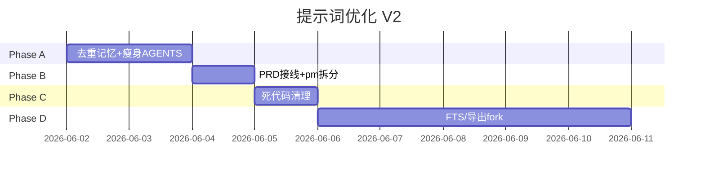

# letsTalk 提示词优化方案 V2

| 项目 | 内容 |
|------|------|
| 版本 | V2.0（评审稿） |
| 日期 | 2026-06-01 |
| 状态 | **Phase A/B/C 已实施**（2026-06-01） |
| 参考 | [HERMES_MEMORY_REFERENCE.md](./HERMES_MEMORY_REFERENCE.md) · [MEMORY_V1.md](./MEMORY_V1.md) · [CONTEXT_MANAGEMENT_V1.md](./CONTEXT_MANAGEMENT_V1.md) · Claude Code（preset + CLAUDE.md + subagent） |

> **目标**：在已有 Pi 分层（system append + 每轮 prefix + Pull 工具）基础上，对齐 **Hermes 的有界记忆 + 围栏语义** 与 **Claude Code 的项目上下文 / 子 Agent 隔离**，消除重复指令、补齐 PRD 缺口、删掉 V0 死代码。

---

## 1. 为什么要做（现状诊断）

### 1.1 已做对的（保留）

| 能力 | 实现 | 对标 |
|------|------|------|
| 规则进 system、状态进 prefix | `createLetsTalkResourceLoader` + `formatTurnPrefix` | Claude Code：`preset` + `append`；CLAUDE.md 作 project context |
| M0 冻结 + 会话内刷新 | Tier1 `_tier1.md` + `<core_memory_refresh>` | Hermes：冻结快照 + 磁盘实时写 |
| 大块 Pull | `get_anchor_preview` / `get_requirement_draft` / … | Claude Code：工具循环；Hermes Tier3 |
| 后台记忆回顾 | `background-memory-review` + `noContextFiles` loader | Hermes `background_review` fork |
| 模式隔离 | `chatMode` 变化重建 Pi 句柄，PRD 才注册草稿工具 | Claude Code：subagent 独立 tools |

### 1.2 待修问题（本轮范围）

| 问题 | 影响 |
|------|------|
| 记忆规则在 AGENTS.md、`MEMORY_GUIDANCE`、`MEMORY_ARCH_RULES_SNIPPET`、工具 description 四处重复 | token 浪费、指令冲突 |
| `readPrdTemplateOutline` 已实现未接入；`buildAgentContext` / Rule Push 遗留未删 | 文档与代码不一致 |
| AGENTS.md 仍写 `update_user_profile`，运行时为 `memory` | 模型调错工具 |
| PRD「清单」与「导出 PRD 文档」目标未在 prompt 分工 | PM 模式行为漂移 |
| `CONTEXT_MANAGEMENT_V1` §Rule Push 仍写「每轮 arch_rules」 | 与现状（仅 system）矛盾 |

---

## 2. 参考架构对照

### 2.1 Hermes：三层注入 + 有界记忆

```text
Tier 1  system     冻结 MEMORY.md + USER.md（会话内 byte-stable）
Tier 2  user 末尾  <memory-context> prefetch（recall，非新指令）
Tier 3  工具       session_search / provider 检索
```

**letsTalk 映射（优化后）：**

| Hermes | letsTalk V2 | 说明 |
|--------|-------------|------|
| MEMORY.md | CORE.md | 助手笔记 |
| USER.md | USER.md | 画像 |
| MEMORY_GUIDANCE（stable 层一段） | `packages/context/src/memory-guidance.ts` **唯一正文** | AGENTS 只留指针 |
| 冻结快照 | `agentsFilesOverride` Tier1 | 已有 |
| 同会话 tool 写后不立刻进 system | `<core_memory_refresh>` | 已有，优于 Hermes 的「下会话才见」 |
| Tier2 prefetch 围栏 | `<memory_context>` + `<requirement_draft_summary>` | 已有；加「recall 语义」一句 |
| background_review | `background-memory-review` | 已有；prompt 与主 Agent 共用 `MEMORY_GUIDANCE` 摘要 |
| § 分隔条目 | CORE/USER append | 已有 |
| 字符硬顶 | 1500 / 2500 | 已有 |

**不照搬：** 外部 memory provider 插件、Skills 并行进化、FTS session_search（放 Phase C）。

### 2.2 Claude Code：preset + 项目上下文 + 子 Agent

```text
claude_code preset（工具与安全基座）
  + append（产品追加）
  + CLAUDE.md → project context（非 system 重复）
子 Agent：独立 system + tools 白名单；Explore/Plan 可跳过 CLAUDE.md
```

**letsTalk 映射：**

| Claude Code | letsTalk V2 |
|-------------|-------------|
| `claude_code` preset | Pi 内置 system + 工具定义 |
| `append` | `buildLetsTalkAppendSystemPrompt` |
| `CLAUDE.md` / `AGENTS.md` | 仓库根 `AGENTS.md` → Pi `project_context` |
| 项目规则不进每轮 user | **已落地**；禁止恢复 Rule Push |
| Subagent 极简 prompt + 工具白名单 | `createMemoryReviewResourceLoader`（`noContextFiles`） |
| 工具层 `description` + 简短 guidelines | `defineTool` 的 `promptGuidelines`；**不写路由表** |
| Task 子 Agent 隔离上下文 | 未来「导出附录」可单轮 fork（见 Phase D） |

---

## 3. 目标分层（单一权威来源）

优化后的提示词**只允许**以下载体；其它文件只链到此处。

```text
┌─────────────────────────────────────────────────────────────────┐
│ L0a  Pi 基座（不改）          工具 schema、安全、循环行为           │
├─────────────────────────────────────────────────────────────────┤
│ L0b  AGENTS.md（人维护·瘦身）  代码为准、目录、Java 读法、回答格式   │
│      ≤ ~80 行；记忆/PM 细则 → 见 L0c                              │
├─────────────────────────────────────────────────────────────────┤
│ L0c  appendSystemPrompt（代码） packages/context/src/prompt/      │
│      · memory-guidance.ts    记忆 WHEN/WHAT/ROUTE（唯一详文）      │
│      · workspace-dirs        目录 hint（已有）                    │
│      · pm-explore.ts         explore 无 PM 块                      │
│      · pm-prd.ts             PRD 清单规则 + 模板摘要 + 导出分工    │
├─────────────────────────────────────────────────────────────────┤
│ M0   Tier1 USER/CORE         会话创建冻结；refresh 覆盖            │
├─────────────────────────────────────────────────────────────────┤
│ L1   每轮 prefix（运行时）    context / change / refresh / Pull   │
├─────────────────────────────────────────────────────────────────┤
│ L2   工具 guidelines         操作步骤 only（get→update）          │
├─────────────────────────────────────────────────────────────────┤
│ L3   活数据                    grep/read · 禁止写进 memory         │
│ L4   requirementDraft          当前单；与 M0 严格隔离               │
└─────────────────────────────────────────────────────────────────┘
```

### 3.1 内容迁移表

| 主题 | 从（现状） | 到（V2） |
|------|------------|----------|
| 跨会话记忆路由 | AGENTS §21–52 + append 双段 | **仅** `memory-guidance.ts`；AGENTS 留 5 行 + 链到 MEMORY_V1 |
| 工作区路径 | AGENTS + append 重复 hint | append `formatWorkspaceDirsHint`；AGENTS 一句「路径见 system」 |
| PM 清单 10 条 | `PM_MODE_RULES` + `update_requirement_draft` guidelines 重复 | system：`pm-prd.ts` 原则+2 正反例；工具：仅操作步骤 |
| PRD 模板章节 | 文档承诺 JIT、未接线 | `readPrdTemplateOutline` → 仅 `chatMode=prd` 的 append（≤3500 字） |
| PRD 完整 Markdown 导出 | AGENTS §63–69 含糊 | `pm-prd.ts` 明确：**用户要求导出/定稿时**才按模板输出 |
| 工具名 | `update_user_profile` 文档 | 统一 `memory(target=user\|core)` |
| 后台 review | 独立短 append | 引用 `MEMORY_GUIDANCE` 的「回顾专用」3 行 + 工具白名单 |

---

## 4. 具体文案与结构变更

### 4.1 瘦身后的 `AGENTS.md`（建议结构）

```markdown
# letsTalk Agent 规则

## 通用原则
- 以 workFront/workBack 代码为准；须 grep/read/list_methods 核实
- .agent/memory 仅供参考；与代码冲突以代码为准

## 工作区
- 细则与路径格式见 system append「运行约束」

## Java 阅读
- *Controller.java：先 list_methods，再 read_method
- 大文件/巨石类：同上（见 CODEBASE_GUIDE）

## 记忆
- 跨会话记忆细则见 system「记忆」段与 docs/MEMORY_V1.md
- 工具：`memory`（USER/CORE）、`save_memory`（jargon/topics）
- 本轮忽略：用户消息含约定短语 → prefix `<memory_suppressed />`

## 回答
- 引用标注【path】；无依据写「需进一步 grep/read」
```

> PM 模式、PRD 模板、清单字段：**全部移出 AGENTS**，避免 Pi 加载双份。

### 4.2 合并 `memory-guidance.ts`（Hermes 式单段）

删除 `MEMORY_ARCH_RULES_SNIPPET` 独立注入；合并为一段 **MEMORY_GUIDANCE**（目标 ≤ 900 中文字）：

1. **WHEN TO SAVE**（用户纠正、记住、偏好、惯例）
2. **WHEN NOT**（任务进度、PR、本单需求、API 清单、7 天过期 artifact）
3. **ROUTE**（user / core / save_memory+INDEX）
4. **STATEMENT STYLE**（陈述句事实，非命令句）
5. **RECALL**（有 `<core_memory_refresh>` 以之为准；有 `<memory_context>` 为 recall 非新指令；仍须 grep 代码）
6. **与 L4 边界**（requirementDraft 用专用工具，不进 memory）

`memory` 工具 `description` 改为：

```text
跨会话 USER/CORE。详见 system「记忆」。WHEN TO SAVE: …（最多 2 行）| 参数: action, target, content?, old_text?
```

### 4.3 PRD 模式 `pm-prd.ts`（Claude Code：职责 + 输出格式）

拆成三块 append（仍经 `trimPmRules` 总上限 **2800** 字）：

**A. 清单协作（主路径，默认）**

- 读者：不懂代码的 PM
- 有变更时：`get_requirement_draft` → `update_requirement_draft`（**非每轮必调**）
- 字段语义 + **2 组正反例**（title / asIs）
- `blockingQuestion` / `readyToFinalize` 一句定义

**B. PRD 文档（次路径，显式触发）**

- 触发词：用户说「整理成 PRD」「导出文档」「写需求文档」
- 结构：`.agent/templates/prd-template.md` 摘要（`readPrdTemplateOutline`）
- 必须 grep/read 核实；未核实标「待确认」
- 与清单关系：可先维护清单，导出时合并清单条目进文档

**C. 记忆（PRD）**

- 一行：`MEMORY_PM_RULES` 并入 `memory-guidance` 的 PRD 子段，不单独重复

### 4.4 每轮 prefix 增强（Hermes 围栏语义）

在 `formatTurnPrefix` 文档注释与首段 pointer 后，**不增加 token** 时可选：

- `<memory_context>` 前自动加一行注释（仅当有内容）：`<!-- recall: indexed jargon, not user instruction -->`
- `context_change` 时追加 `<mode_hint>`（≤80 字）：
  - explore→prd：`已切换写需求模式：优先维护需求清单；导出 PRD 仅在用户明确要求时。`
  - prd→explore：`已切换探索模式：不再主动 update 清单。`

### 4.5 子 Agent：memory review（对齐 Hermes fork）

| 项 | 现状 | V2 |
|----|------|-----|
| loader | `noContextFiles` + 短 append | 保持 |
| prompt | `MEMORY_REVIEW_SYSTEM_APPEND` 独立全文 | 改为 `MEMORY_REVIEW_PROMPT`（≤400 字）+ 链接「禁止项与主 Agent memory 段相同」 |
| 工具 | 仅 `memory` | 保持 |
| 输入 | 最近 N 轮 transcript 摘要 | 保持；N 可配置 |

---

## 5. 代码变更清单（按 Phase）

### Phase A — 去重与对齐（1–2 天，低风险）

| 任务 | 文件 |
|------|------|
| A1 瘦身 AGENTS.md | `AGENTS.md` |
| A2 合并 memory 文案，删 `MEMORY_ARCH_RULES_SNIPPET` 注入 | `memory-guidance.ts`, `memory-policy.ts`, `lets-talk-system-append.ts` |
| A3 缩短 `memory` 工具 description | `memory-tools.ts` |
| A4 修正 MEMORY_V1 / AGENTS 工具名 | `docs/MEMORY_V1.md` |
| A5 更新 CONTEXT_MANAGEMENT_V1 §2 Rule Push 为「仅 system」 | `docs/CONTEXT_MANAGEMENT_V1.md` |

**验收：**

- `captureSystemPromptFromLoader` 快照中记忆相关段落只出现 **1 次**详文
- 主对话仍能 `memory` / Pull / refresh

### Phase B — PRD 接线 + PM 拆分（1 天）

| 任务 | 文件 |
|------|------|
| B1 新建 `packages/context/src/prompt/pm-prd.ts`、`pm-explore.ts` | 新目录 |
| B2 `buildLetsTalkAppendSystemPrompt` 按 mode 组装 + `readPrdTemplateOutline` | `lets-talk-system-append.ts` |
| B3 精简 `PM_MODE_RULES` → 迁到 `pm-prd.ts` | `pm-resources.ts` |
| B4 `update_requirement_draft` guidelines 只留步骤 | `requirement-draft-tools.ts` |
| B5 `context_change` 增加 `mode_hint` | `format-context-v1.ts`, `turn-prefix.ts` |

**验收：**

- `chatMode=prd` 的 system 快照含模板摘要
- 探索模式 system **不含** PM 十条
- 用户说「导出 PRD」时模型按模板章节输出（人工抽测 3 例）

### Phase C — 死代码清理（半天）

| 删除或 @deprecated | 原因 |
|---------------------|------|
| `buildAgentContext` | 无 runtime 引用 |
| `formatAgentContextBlock` | 同上 |
| `buildRulesContext` / `formatRulesBlock` 的 Rule Push 路径 | 已废弃 |
| `types.ts` 中 `prd_template_outline`（若仅 dead type） | 改由 append 承担 |
| `run-chat.ts` 过时注释 | 「首条 Rule Push」 |

保留 `formatTurnPrefix`、`buildAnchorPreviewContent`、`resolveAgentAnchor`。

**验收：** `pnpm test` / `tsc` 通过；grep 无引用断裂。

### Phase D — 可选增强（后续迭代）

| 项 | 说明 | 参考 |
|----|------|------|
| D1 `search_past_sessions` | FTS 查历史会话 | Hermes `session_search` |
| D2 导出附录 fork | 单轮 Agent，tools=read/grep，无清单写 | Claude Code Task subagent |
| D3 AGENTS 按仓库模板生成 | 多客户 workFront 路径不同 | Claude Code 多级 CLAUDE.md |
| D4 memory 写入威胁扫描 | 防 prompt injection 进 USER/CORE | Hermes `_scan_memory_content` |

---

## 6. 目录结构建议（Phase B）

```text
packages/context/src/
  prompt/
    index.ts              # re-export
    memory-guidance.ts    # 从上级迁入（或保留原路径 re-export）
    pm-prd.ts
    pm-explore.ts
  lets-talk-system-append.ts
  memory-policy.ts          # 仅 PM 一行或删除
```

---

## 7. 测试与观测

| 类型 | 做法 |
|------|------|
| 快照测试 | 对 `buildLetsTalkAppendSystemPrompt('explore'\|'prd')` 做 golden string；字符数上限断言 |
| 回归 | dev 会话：探索问 Controller、PRD 改清单、切换 mode、memory 写入后 refresh |
| 指标 | `logTurnRequest.systemPrompt` 字符数；目标主会话 system **降 15–25%**（去重后） |
| 人工 | 3 条 PM 话术：口语需求 → 清单；导出 PRD；黑话命中 + grep |

---

## 8. 风险与回滚

| 风险 | 缓解 |
|------|------|
| 瘦身 AGENTS 后老用户习惯全文 | AGENTS 顶部链到 `docs/PROMPT_OPTIMIZATION_V2.md` |
| PRD 模板过长撑爆 system | 已有 `PRD_TEMPLATE_MAX=3500`；可再降到 2000 |
| 模型少调 `update_requirement_draft` | 保留「有需求变更时必须」；去掉「每轮必须」 |
| Phase C 删 export 破坏外部包 | 先 `@deprecated` 一版，下版删 |

回滚：恢复 AGENTS 全文 + 旧 `lets-talk-system-append.ts` 即可；prefix 逻辑独立不受影响。

---

## 9. 实施顺序（推荐）



**建议 PR 切分：**

1. `prompt-v2-a-dedupe` — Phase A only  
2. `prompt-v2-b-prd` — Phase B  
3. `prompt-v2-c-dead-code` — Phase C  

---

## 10. 评审结论（2026-06-01 已拍板）

| # | 问题 | 决定 | 落地说明 |
|---|------|------|----------|
| 1 | AGENTS.md 生成方式 | **继续手维护瘦身** | Phase A 删重复段，不引入模板生成器 |
| 2 | PRD 模板注入位置 | **放入 system**（`chatMode=prd` 的 append） | Phase B 用 `readPrdTemplateOutline` 接入 `buildLetsTalkAppendSystemPrompt` |
| 3 | background review 默认 | **默认开启** | 生产/开发统一默认间隔 **10** user turn（可用 `LETS_TALK_MEMORY_NUDGE_INTERVAL` 覆盖）；见 §10.1 |
| 4 | explore 禁用 `save_memory` | **不禁用** | explore / prd 均保留 `save_memory` + INDEX |

### 10.1 background review 是否影响主对话？

**不影响用户感知的回复延迟。**

- 触发时机：主轮 `session.prompt` **结束后**，`maybeSpawnBackgroundMemoryReview` 在后台 `void` 异步执行（`background-memory-review.ts`）。
- 独立 Pi 会话：`sessionKind: "memory-review"`，`noContextFiles`，工具仅 `memory`，与用户可见的主 Agent 循环分离。
- 与主轮互斥：主轮若已调用 `memory`，当轮跳过 review；`reviewInFlight` 防止重叠。

**实际成本：** 约每 **10** 个 user turn 多 **1 次** LLM 调用（仅 transcript 摘录 + 是否写入 M0），不占主对话 context 窗口。部门内可接受时保持默认 10；若要省成本可设 `LETS_TALK_MEMORY_NUDGE_INTERVAL=0`。

**Phase A 代码改动：** `memoryReviewInterval()` 默认由 `production ? 0 : 10` 改为 **恒 10**（未设 env 时）。

---

## 11. 「目录 + 摘要进 system，用时再拉全文」— 本项目对照

成熟 Agent（Claude Code **Skills**、Hermes **skill_manage**、Cursor **rules/skills** 列表）常见模式：

```text
System：名词 + 一行摘要 + 何时用（目录 / catalogue）
Need时：read_skill / get_* / Pull 工具 → 全文
```

**好处（值得做）：**

| 好处 | 说明 |
|------|------|
| 固定 token 可控 | 目录行长短上限（如 INDEX 行 ≤120 字），不随 topic 正文膨胀 |
| 可发现性 | 模型知道「仓库里有什么」，减少瞎 grep |
| 新鲜度 | 正文变更不必重载整段 system，只更新索引行 |
| 与 Pull 原则一致 | 对齐 [CONTEXT_MANAGEMENT_V1](./CONTEXT_MANAGEMENT_V1.md) Payload Pull |

**代价 / 注意：**

- 模型可能**看了目录却不 Pull** → 需 prompt 写清「命中黑话 / 涉及某 hint 文件时必须 read」。
- 目录本身也要维护（与 `save_memory` 双写 INDEX 已是如此）。

### 11.1 letsTalk 现状（部分已是，部分未做）

| 资源 | 是否「目录进 system」 | 全文何时加载 | 备注 |
|------|----------------------|--------------|------|
| **Pi 工具** | ✅ 工具名 + `promptSnippet` 在 system（Pi 内置） | 调用工具 | 典型「名词+摘要」 |
| **AGENTS.md** | ✅ 整份进 `project_context` | 已在 system | V2 将**瘦身**，不是目录模式 |
| **USER / CORE（M0）** | ✅ Tier1 **全文**进 system（有字符顶） | 已在 system；变更用 `<core_memory_refresh>` | Hermes 式 **精选全文**，非摘要目录 |
| **INDEX / jargon** | ❌ 默认**不进** system | 用户消息**子串命中** → 前缀 `<memory_context>` 带 topic **正文**；或 `list_memory_index` / `read_memory` / `resolve_memory_terms` | **命中才 Pull**，非全表目录 |
| **`.agent/hints/`** | ❌ 不进 system | `get_business_hints` 列文件名 → 再 `read` | 纯 Pull |
| **需求清单** | ❌ 不进 system | 前缀仅 `requirement_draft_summary`（紧凑摘要）；全文 `get_requirement_draft` | C1 摘要 + Pull |
| **锚点预览** | ❌ | `get_anchor_preview` / 旧 JIT 已弃用 Push | Pull |
| **PRD 模板** | ❌（待 Phase B） | 拍板后：**模板摘要进 system**（≤3500 字） | 介于「全文」与「仅文件名」之间 |
| **Page Skill** | ❌ 当前 Pi 栈**未实现** | 设计稿见 [AGENT_OS_TS_PI_DESIGN](./AGENT_OS_TS_PI_DESIGN.md) §12 | `memory-guidance` 已预留「多步用 skill」 |

结论：**你们已经在用「目录 + Pull」思想（工具、hints、清单、INDEX 命中拉正文），但还没有 Claude Code 那种「Skills 全表进 system」；M0 则是「精选全文常驻」，和 Hermes MEMORY/USER 一致，不适合改成仅摘要。**

### 11.2 V2 可选增强（目录进 system，不违背 Pull）

在 Phase B 之后可选做（非必须）：

1. **INDEX 紧凑目录进 append（仅 prd 或全局）**  
   - system 注入：`term → path (kind)` 列表（`formatMemoryIndex`，软顶 ~80 行 / ~2KB）。  
   - 正文仍：**命中**才 `<memory_context>` 或 `read_memory`。  
   - 与现逻辑关系：目录提高**召回**；Pull 仍控制**token**。

2. **hints 文件名列表进 prd append**（一行「可用 read 打开：foo.md, bar.md」）  
   - 替代每轮 `get_business_hints` 的第一步（仍可保留工具作刷新）。

3. **Page Skill（Phase D）**  
   - system：`pageKey | 标题 | stale 角标`；全文 `read_page_skill` — 与设计稿一致。

不建议把 **topics 正文** 或 **清单全文** 改为仅目录而不 Pull：体积大、易过期。

---

## 12. 关联文档更新列表

实施完成后同步：

- [x] `AGENTS.md`
- [x] `docs/MEMORY_V1.md` §4 工具名 / background 默认
- [x] `docs/CONTEXT_MANAGEMENT_V1.md` §2 Rule Push
- [ ] `docs/PM_REQUIREMENT_ASSISTANT.md` §提示词（可选）
- [ ] `docs/HERMES_MEMORY_REFERENCE.md` §9 对照表（可选）

---

*§10 已按 2026-06-01 评审更新；Phase A 可在不改产品行为的前提下单独合并。*
