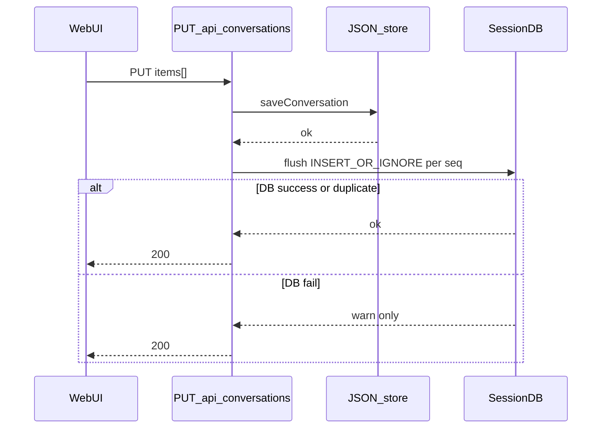

# letsTalk 会话冷存储 — state.db 设计（V1.2）

| 项目 | 内容 |
|------|------|
| 版本 | V1.2（评审修订 #2） |
| 日期 | 2026-06-04 |
| 状态 | **Phase 0+1 已落地**（双写 + import CLI + session_search V1） |
| 参考 | [Hermes session-storage](https://hermes-agent.nousresearch.com/docs/developer-guide/session-storage) · 本地 `hermes-agent/hermes_state.py` |
| 关联 | [SESSION_SEARCH_V1.md](./SESSION_SEARCH_V1.md) · [MEMORY_V1.md](./MEMORY_V1.md)（E0 Episodic）· [HERMES_MEMORY_REFERENCE.md](./HERMES_MEMORY_REFERENCE.md) |

---

## 1. 为什么要引入 state.db

letsTalk 当前会话持久化是 **按 session 一个 JSON 文件**：

```text
.agent/conversations/{sessionId}.json     ← UI Transcript + meta + requirementDraft
.agent/conversations/pi/{sessionId}.jsonl ← Pi 多轮上下文（Agent 续聊）
```

这套方案解决了 **刷新页面气泡还在**、**HMR 后 Pi 上下文恢复**，但有三类缺口：

| 缺口 | 现状 | 影响 |
|------|------|------|
| **跨会话检索** | 只能侧栏按时间翻 JSON | 「上周聊过收支明细删除逻辑吗？」无法 FTS |
| **列表与统计** | `readdir` + 逐文件 `readFile` | 会话多了以后 list / 分组 / token 统计变慢 |
| **Agent 按需 recall** | 无工具 | MEMORY_V1 Phase C 的 `session_search` 无落点 |
| **双写一致性** | Transcript JSON 与 Pi jsonl 分离 | 导出、审计、搜索需拼两份数据源 |

**state.db 的定位：冷存储 / 会话档案库** —— 存 **完整 transcript + 元数据 + 可搜索索引**，**不**替代：

- **M0 记忆**（`.agent/memory/USER.md` + `CORE.md`）— 仍是有界、策展、每轮注入
- **Pi jsonl** —— 仍是 Agent 续聊的 **热上下文** 权威源（短期不迁 SQLite）
- **requirementDraft** —— 仍是 L4 任务态；**编辑与权威源仍在 JSON**，DB 至多存 `has_draft` 标记（见 §3.2）

```text
┌─────────────────────────────────────────────────────────────┐
│ 热路径（每轮必走）                                            │
│  Pi jsonl · Tier1 USER/CORE · Tier2 INDEX Pull · L4 清单     │
├─────────────────────────────────────────────────────────────┤
│ 温路径（UI / API）                                            │
│  Transcript JSON（Phase A 双写过渡期的 source of truth）       │
├─────────────────────────────────────────────────────────────┤
│ 冷路径（按需）← state.db 新增                                 │
│  FTS 跨会话搜索 · 侧栏列表 · 导出 · session_search 工具       │
└─────────────────────────────────────────────────────────────┘
```

---

## 2. 与 Hermes state.db 的对照

| 维度 | Hermes | letsTalk V1 建议 |
|------|--------|------------------|
| 路径 | `~/.hermes/state.db` | `{WORKSPACE_ROOT}/.agent/state.db` |
| 范围 | 全局（profile 用 HERMES_HOME） | **单工作区**（与 ERP 仓库绑定） |
| WAL | 是，多进程 gateway | 是，Next dev + agent-runtime 可能并发写 |
| FTS5 | `messages_fts` + `messages_fts_trigram`（历史包袱） | **单表** `messages_fts`，`tokenize=trigram`（ASCII + CJK 共用） |
| system_prompt 快照 | 存 sessions 表，保 prefix cache | **不做**（Pi prompt 组装不同，续聊靠 jsonl） |
| session 来源 | cli / telegram / discord… | 固定 `web`（后续可加 `cli`） |
| 工具 | `session_search` 三模式 | 同名；Discovery **硬限返回量**（见 §5.3） |

Hermes 拆两个 FTS 表是因为早期 unigram 索引的历史包袱；letsTalk **从零建库，只用一个 trigram 表**。

Hermes 文档明确：**MEMORY.md 是策展摘要，state.db 是全量录像 + 搜索引擎**。letsTalk 沿用同一分工。

---

## 3. 数据库 Schema（建议）

### 3.1 表概览

```text
.agent/state.db
├── schema_version          — 迁移版本（单值）
├── sessions                — 会话元数据
├── messages                — 消息行（user/assistant/tool/system）
└── messages_fts            — FTS5 虚拟表（trigram；content + tool_name）
```

`anchor_json` 放在 `sessions` 列即可；**不**单独拆 `session_anchors` 表（v1 无按锚点过滤的硬需求）。

### 3.2 `sessions`

```sql
CREATE TABLE IF NOT EXISTS sessions (
    id              TEXT PRIMARY KEY,           -- letsTalk sessionId (UUID)
    source          TEXT NOT NULL DEFAULT 'web',
    title           TEXT,
    title_locked    INTEGER DEFAULT 0,
    chat_mode       TEXT DEFAULT 'explore',     -- explore | prd
    model           TEXT,
    pi_session_file TEXT,                       -- 相对 WORKSPACE_ROOT 的 jsonl 路径
    anchor_json     TEXT,                       -- AgentAnchor 快照（可空）
    has_draft       INTEGER DEFAULT 0,          -- 是否有 requirementDraft（0/1）；内容仍在 JSON
    created_at      TEXT NOT NULL,              -- ISO8601
    updated_at      TEXT NOT NULL,
    ended_at        TEXT,                       -- MVP 不写入，恒 NULL（见 §5.1）
    parent_session_id TEXT,                     -- 压缩/分支 lineage（Pi compact 续篇）
    message_count   INTEGER DEFAULT 0,
    input_tokens    INTEGER DEFAULT 0,
    output_tokens   INTEGER DEFAULT 0,
    FOREIGN KEY (parent_session_id) REFERENCES sessions(id)
);

CREATE INDEX IF NOT EXISTS idx_sessions_updated ON sessions(updated_at DESC);
CREATE INDEX IF NOT EXISTS idx_sessions_parent ON sessions(parent_session_id);
```

**为何不镜像 `requirement_draft_json`：** 清单编辑权威在 JSON；镜像会多一条易过时的写入路径。侧栏/filter 只需 `has_draft`；**Phase 2** 若要做「搜历史需求 cell 正文」，再把 cell 文本 **索引进 FTS**（仍不以 DB 为编辑源）。

**侧栏排序用 `updated_at DESC`**，MVP 不依赖 `ended_at`。

### 3.3 `messages`

**content 存 UI Transcript 已归一化的文本**（工具块用 preview，不存 base64）。

```sql
CREATE TABLE IF NOT EXISTS messages (
    id              INTEGER PRIMARY KEY AUTOINCREMENT,
    session_id      TEXT NOT NULL REFERENCES sessions(id) ON DELETE CASCADE,
    seq             INTEGER NOT NULL,           -- 会话内顺序（0-based，对齐 TranscriptItem 顺序）
    role            TEXT NOT NULL,              -- user | assistant | tool | system
    kind            TEXT,                       -- letsTalk TranscriptItem.kind
    content         TEXT,
    tool_name       TEXT,
    tool_call_id    TEXT,
    tool_calls_json TEXT,
    metadata_json   TEXT,                       -- turnId、draftRevision 等（可选）
    created_at      TEXT NOT NULL
);

CREATE UNIQUE INDEX IF NOT EXISTS idx_messages_session_seq
    ON messages(session_id, seq);
CREATE INDEX IF NOT EXISTS idx_messages_session ON messages(session_id, id);
```

**写入策略：幂等 flush** —— 不维护 `db_flush_seq` 或进程内 cursor；每次 flush 对 JSON 中 `items[]` 逐条：

> **注意：** `content` 列有 4000 字符截断（`transcript-db-mapper.ts` 中 `PREVIEW_MAX = 4000`）。超出部分被静默丢弃。此截断对所有角色（user、assistant、tool、context、export_ready）均生效，不另行记录。需要完整正文的场景应直接引用 `.agent/conversations/*.json`。

```text
flush_messages(sessionId, items[]):
  for (seq, item) in items.entries():
    INSERT OR IGNORE INTO messages (session_id, seq, ...) VALUES (...)
  -- (session_id, seq) UNIQUE 保证幂等；重复 flush / 前端重试 / 超时重放均安全
```

### 3.4 FTS5（单表 trigram）

```sql
-- tokenize=trigram：英文前缀 + 中文子串，一张表够用
CREATE VIRTUAL TABLE IF NOT EXISTS messages_fts USING fts5(
    content,
    tool_name,
    content='messages',
    content_rowid='id',
    tokenize='trigram'
);

-- INSERT
CREATE TRIGGER IF NOT EXISTS messages_fts_insert AFTER INSERT ON messages BEGIN
  INSERT INTO messages_fts(rowid, content, tool_name)
  VALUES (new.id, COALESCE(new.content, ''), COALESCE(new.tool_name, ''));
END;

-- DELETE（external content 模式须用 'delete' 行，不能 DELETE FROM messages_fts）
CREATE TRIGGER IF NOT EXISTS messages_fts_delete AFTER DELETE ON messages BEGIN
  INSERT INTO messages_fts(messages_fts, rowid, content, tool_name)
  VALUES ('delete', old.id, COALESCE(old.content, ''), COALESCE(old.tool_name, ''));
END;

-- UPDATE
CREATE TRIGGER IF NOT EXISTS messages_fts_update AFTER UPDATE ON messages BEGIN
  INSERT INTO messages_fts(messages_fts, rowid, content, tool_name)
  VALUES ('delete', old.id, COALESCE(old.content, ''), COALESCE(old.tool_name, ''));
  INSERT INTO messages_fts(rowid, content, tool_name)
  VALUES (new.id, COALESCE(new.content, ''), COALESCE(new.tool_name, ''));
END;
```

- 整段 DDL 在 [`packages/conversation/src/schema.ts`](packages/conversation/src/schema.ts) 实现（`SCHEMA_V1_BASE_SQL` + `SCHEMA_V1_FTS_SQL`），编译后由 `SessionDB.migrate()` 执行；`schema.sql` 仅作注释参考
- FTS 模块不可用 → **降级** `LIKE` + 日志告警；`session_search` 仍可用但慢
- **不**维护第二套 unigram 表，查询侧不做 union / 分支选择

---

## 4. 包与模块划分

**扩展现有 `packages/conversation`**，不新建 `session-store`。

| 理由 | 说明 |
|------|------|
| 同一生命周期 | 建会话、存消息、列列表本就属于 conversation |
| 语义归属 | 「会话」对外 API 不变，SQLite 是存储实现细节 |
| 工程成本 | 少一个包的 lint / build / watch；避免 conversation ↔ session-store 循环依赖 |

在 `packages/conversation/src/` 内新增：

| 模块 | 职责 |
|------|------|
| `store.ts` | **保留** JSON 读写（Phase A source of truth） |
| `session-db.ts` | `SessionDB`：open、migrate、WAL、降级开关 |
| `db-search.ts` | FTS 查询、discovery/scroll/browse 三模式、snippet、±window |
| `import-json.ts` | 从 JSON 批量导入 DB 的核心逻辑 |

**CLI 入口**（对齐 [`packages/skills`](packages/skills/package.json) 的 `tsx scripts/` 模式，**不用** `bin` 字段）：

| 位置 | 内容 |
|------|------|
| [`packages/conversation/scripts/import-sessions.ts`](packages/conversation/scripts/import-sessions.ts) | CLI 入口；可 re-export `src/import-json.ts` |
| `packages/conversation/package.json` | `"import-sessions": "tsx scripts/import-sessions.ts"` |
| 根 [`package.json`](package.json) | `"sessions:import": "pnpm --filter @lets-talk/conversation import-sessions"` |

用法：`pnpm sessions:import` — 读取 `WORKSPACE_ROOT` 下 `.agent/conversations/*.json` → DB，`INSERT OR IGNORE` 幂等，可重复跑。

**依赖：** `better-sqlite3`（同步 API，与 agent-runtime 同进程友好）。

**运行时约束：** API Routes 必须使用 **`export const runtime = 'nodejs'`**（或项目默认 Node runtime）。**Edge Runtime 不支持** better-sqlite3 / 原生模块——若未来要上 Edge，需换 HTTP 侧车或 `node:sqlite` PoC，**不在 MVP 范围**。

---

## 5. 集成点

### 5.1 写入（双写过渡期）

| 时机 | JSON（权威） | + state.db |
|------|-------------|------------|
| 新建会话 | `POST /api/conversations` | `sessions.insert`（best-effort） |
| 每轮结束 | 前端 `PUT` transcript | 同请求或 `turn_end` 后 `flush_messages` |
| Pi 绑定 | `bindPiSessionFile` | 更新 `pi_session_file` |
| 锚点/模式 | PUT JSON | 更新 `anchor_json` / `chat_mode` |
| 清单有无 | PUT JSON `requirementDraft` | 更新 `has_draft`（0/1），**不写清单正文** |
| **ended_at** | — | **MVP 不实现**；列恒 `NULL`。会话续篇/终结由 Pi compact 的 `parent_session_id` lineage 表达。Phase 2 再定是否在 `DELETE /api/conversations/:id` 时写入或 soft-delete |

**双写一致性（已定）：**

```text
1. 先写 JSON（成功 = 用户可见状态已持久化）
2. 再 flush DB（best-effort）：对 items[] 全量 INSERT OR IGNORE
   - 成功 → 完成
   - 失败 → logger.warn；下次 PUT 重放同一批 INSERT OR IGNORE
3. 绝不因 DB 失败让 API 返回 500（Phase A）
```

JSON 成功、DB 失败时：**不丢用户数据**；搜索/列表可能短暂滞后，直到下一次 flush 重试对齐。

**幂等重放：**

| 场景 | 行为 |
|------|------|
| DB 写成功、HTTP 超时、前端重试 PUT | 再次 `INSERT OR IGNORE`，`(session_id, seq)` 冲突静默跳过 |
| DB 写失败、JSON 已成功 | 下次 flush 重放全部 items，仍 OR IGNORE |
| `pnpm sessions:import` 重复跑 | 同左 |

**不需要** 进程内 `lastFlushedSeq`、**不需要** `db_flush_seq`、**不需要** dirty 标记（warn 日志可选，非 correctness 依赖）。



### 5.2 读取

| 消费者 | Phase A | Phase B+ |
|--------|---------|----------|
| 侧栏列表 | DB 优先，失败 fallback `readdir` JSON | DB |
| 打开会话 Transcript | **JSON** | 可选改从 `messages` 重建 |
| `session_search` | DB；DB 不可用则工具返回明确错误 | 同左 |
| Web 全局搜索 | Phase 2 | FTS API |

### 5.3 Agent 工具：`session_search`

详文见 **[SESSION_SEARCH_V1.md](./SESSION_SEARCH_V1.md)**。摘要：

| 模式 | 行为 | 硬限制 |
|------|------|--------|
| **Discovery** | `query` → FTS + anchored view | 最多 **3** session；每 session **1** 命中；±5 window + bookend 各 3；软顶 ~80 条 message |
| **Scroll** | `session_id` + `around_message_id` | window 默认 ±5，hard cap 21 条；支持 owning-session rebind |
| **Browse** | 无参 | 最近 **20** 个 session 摘要 |

另：**P1** 用户问历史时自动 `<episodic_recall>` 进 prefix（`LETS_TALK_EPISODIC_PREFETCH`，见 SESSION_SEARCH_V1 §3）。

工具注册：**仅当 `LETS_TALK_SESSION_DB=1` 且 DB open 成功** 时暴露。

### 5.4 与 Pi jsonl 的关系

```text
Pi jsonl  = 模型续聊的 Working Memory（Pi 管理）
state.db  = Episodic Archive（Transcript 语义，letsTalk 管理）
```

- **不**用 DB 替代 Pi prompt 组装
- compact 后：`parent_session_id` lineage + 新 jsonl + 新 session 行
- HMR：**不变**，仍 `SessionManager.open(piSessionFile)`

---

## 6. 迁移计划

### Phase 0 — 基础设施（MVP）

- [x] `packages/conversation` 内 `SessionDB` + [`schema.ts`](packages/conversation/src/schema.ts) v1
- [x] 启动 lazy open + migrate；open 失败 → JSON-only 模式（§8）
- [x] 双写：`saveConversation` / API PUT 后 `flush_messages`（INSERT OR IGNORE）
- [x] `GET /api/conversations` DB + JSON 合并列表
- [x] 单元测试：`pnpm --filter @lets-talk/conversation test:session-db`
- [ ] 集成测试：临时文件 DB + 2 线程并发 append

### Phase 1 — 搜索与工具

- [x] `session_search` V1（胖 Discovery + scroll rebind，见 [SESSION_SEARCH_V1.md](./SESSION_SEARCH_V1.md)）
- [x] MEMORY_V1 / AGENTS.md E0 路由 + episodic prefetch
- [x] [`pnpm sessions:import`](package.json) → `packages/conversation/scripts/import-sessions.ts`（CLI 已就绪；历史数据需手动跑一次）

### Phase 2 — UI 与运维

- [ ] Web 侧栏 FTS 搜索框
- [ ] 需求 cell 文本 **可选** 写入 FTS（PM 搜历史需求；仍不镜像整份 draft JSON）
- [ ] `prune` CLI（按天数删 ended session；默认关）
- [ ] 导出 Markdown / JSON 从 DB 生成

### Phase 3 — 可选

- [ ] UI Transcript 改读 DB，JSON 降为备份/export
- [ ] 按 `anchor.menuId` 过滤历史
- [ ] token 统计

---

## 7. 配置与环境变量

MVP 只保留两个开关；**搜索随 DB 开闭**，不单独配置。

```bash
# .env.example
LETS_TALK_SESSION_DB=1              # 1=SQLite 双写；0=纯 JSON（回滚）
LETS_TALK_SESSION_DB_PATH=          # 空 = {WORKSPACE_ROOT}/.agent/state.db
```

`PRUNE`、独立 `SESSION_SEARCH` 等 **Phase 2 再引入**（若需要）。

---

## 8. 安全、边界与故障兜底

### 8.1 常规边界

| 项 | 处理 |
|----|------|
| **路径** | `.agent/state.db` 随 WORKSPACE_ROOT；**不入 git**（含 `-wal` / `-shm`） |
| **敏感信息** | 与 JSON 同级；内网/本机部署假设 |
| **FTS 注入** | 查询 sanitize（Hermes `_sanitize_fts5_query` 同款） |
| **体积** | 工具结果只存 preview；附件存路径 |
| **并发** | WAL + busy_timeout=1000ms（SQLite 内置 busy handler） |

### 8.2 DB 坏了怎么办（必实现）

| 阶段 | 故障 | 行为 |
|------|------|------|
| **Phase A 双写** | `SessionDB.open()` 失败（权限、locking protocol、corrupt header） | 打 **warn**；进程内 `sessionDbEnabled=false`；**全部读写走 JSON**；API **不 500**；侧栏/list 用 JSON |
| **Phase A 双写** | 运行中写入失败 | warn；下次 PUT **重放 INSERT OR IGNORE**（幂等，无需 dirty 标记） |
| **Phase A 双写** | FTS 不可用 | `detectFts()` 标记 false → `ftsMatch()` 返回空 → `session_search` 在 discovery 模式返回「FTS5 不可用」；DB 双写及 browse/scroll 不受影响 |
| **Phase B DB 为主** | 文件损坏 | 运维：`pnpm sessions:import` 从 JSON 重建；或恢复最近 JSON 备份 |
| **任意** | WAL 残留 | 正常关闭时 checkpoint；异常退出留 `state.db-wal` / `state.db-shm`，已在 `.gitignore` |

**JSON 在 Phase A 始终是逃生舱**——这也是双写过渡期必须保守的原因。

---

## 9. 测试策略

| 层级 | 范围 |
|------|------|
| **单元** | `:memory:` SQLite；migrate idempotent；FTS trigram 中英文；sanitize；**同一 transcript 连续 flush 两次，messages 行数不变** |
| **集成** | 临时目录真实 `state.db`；JSON 成功 + DB 失败 → 下次 flush 对齐；**模拟 HTTP 超时重试 PUT 不重复插入** |
| **并发** | 2+ 线程/进程同时 append **不同** session；同 session 串行（由 API 单写保证） |
| **降级** | 故意 corrupt DB 文件 → open 失败 → 确认 API 仍 200 + JSON 路径可用 |
| **Next** | 确认 chat/conversation API route 声明 **nodejs** runtime（非 edge） |

---

## 10. 验收标准（Phase 0 + 1）

1. 双写开启时 `.agent/state.db` 有 `sessions` / `messages` 行（含 **seq=0** 首条）
2. DB open 失败时 Web 行为与纯 JSON 一致，无 500
3. `session_search(query=…)` 返回真实片段，Discovery 总消息数 **≤20**
4. 中文子串「枚举字典」trigram 可命中
5. `pnpm sessions:import` 后旧 JSON 可搜；重复 import 不重复行
6. `LETS_TALK_SESSION_DB=0` 无回归；`session_search` 工具不出现

---

## 11. 开放问题

1. **Phase B 何时切 Transcript 主读** — 至少双写稳定一个迭代再定
2. **需求 cell 进 FTS** — Phase 2；索引粒度（per-cell row vs 合并文本）待 PM 场景验证
3. **多 worktree** — 每 WORKSPACE_ROOT 独立 DB，不联邦
4. **ended_at 语义** — Phase 2；是否在 DELETE 时 soft-delete vs 硬删行

~~better-sqlite3 vs node:sqlite~~ → MVP 定 **better-sqlite3 + nodejs runtime**；Edge 不在范围。

---

## 12. 文档索引

| 文档 | 关系 |
|------|------|
| [MEMORY_V1.md](./MEMORY_V1.md) | E0 / Phase C 父规格 |
| [MEMORY_SYSTEM.md](./MEMORY_SYSTEM.md) | 记忆 vs 会话分层 |
| [IMPLEMENTATION_PHASES.md](./IMPLEMENTATION_PHASES.md) | 阶段 5 对话记录 |
| [HERMES_MEMORY_REFERENCE.md](./HERMES_MEMORY_REFERENCE.md) | Hermes 调研 |

---

## 13. 修订记录

| 版本 | 变更 |
|------|------|
| V1.0 | 初稿 |
| V1.1 | 扩 `packages/conversation`；单 FTS trigram；去掉 draft 镜像；简化 env；DB 故障兜底；session_search 硬限；双写语义与测试策略 |
| V1.2 | 去掉 `db_flush_seq`，改 INSERT OR IGNORE 幂等 flush；补 FTS trigger SQL；幂等重放场景；ended_at MVP 留 NULL；固定 `pnpm sessions:import` CLI 路径 |

---

*实现状态：Phase 0（`SessionDB` 双写 + `pnpm sessions:import`）与 Phase 1（`session_search` 三模式 + `MEMORY_GUIDANCE` 路由）已落地；见 `packages/conversation/src/db-search.ts`、`packages/agent-runtime/src/session-search-tools.ts`。*
